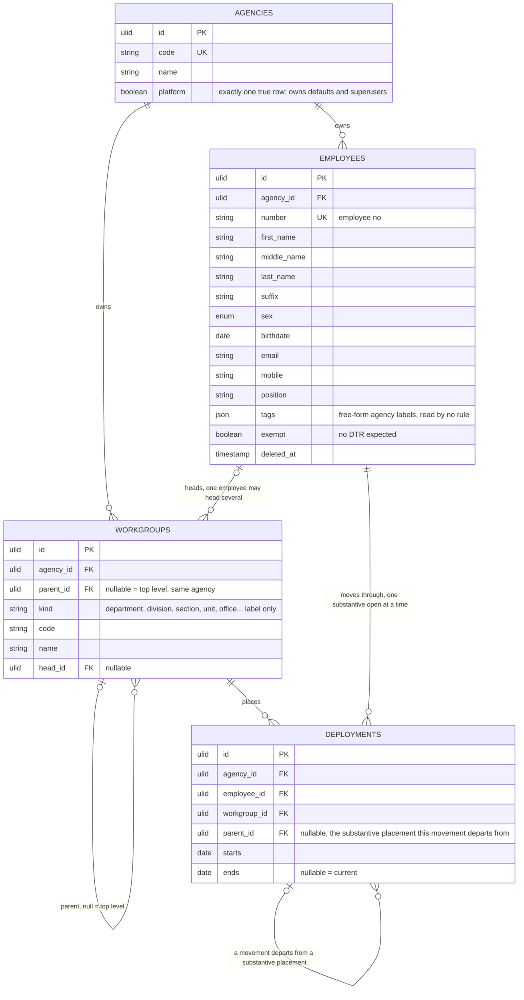

# 01 — organization



## Rules

1. A workgroup's parent is null or another workgroup of the same agency, enforced by a paired FK on `(parent_id, agency_id)`. No cycles, enforced by trigger.
2. An employee has at most one **substantive** deployment per date and at most one **movement** per date: two partial exclusion constraints on `employee_id` and `daterange(starts, ends, '[]')`, partitioned by `parent_id IS NULL`. Each also yields at most one open row of its class. A movement may overlap the substantive placement it departs from — that nesting is the point — but never another movement (nobody is detailed to two places at once). See rule 7.
3. Exactly one agency row has `platform` true, enforced by a partial unique index. It owns the shared rows: national holidays, default shifts and schedules, superusers. It has no employees, workgroups, terminals or teams, enforced by trigger, cannot be deleted, and the flag cannot move. Eloquent hides it from `Agency` queries with a global scope; it is reached through `Agency::platform()`, so lists, counts and reports never see it.
4. "This workgroup and everything under it" is a recursive CTE over `parent_id`.
5. Workgroups are the formal structure: one placement at a time, through `Deployment`. Tags are labels on the employee — free-form, agency-defined, read by no rule — and the way you select many employees at once for an ad-hoc bulk action. A `Team` (04-scheduling.md) is a named `(schedule, anchor)` cohort and is the only one of the three that decides what a person is expected to work. A fact you filter by is a tag; a rotation you belong to is a team. `meta` is inert payload nothing filters on.

6. Deployment ranges are the employment history (decision 28). An open deployment means current employment; the first start and final end record the span, and a new range after a gap records rehire without overwriting earlier service. A person with no placement is not yet started for timekeeping. Tags may distinguish departure from a gap, but no computation reads them. Ending a placement includes its last day and opens no replacement. Removal closes a started open placement on today, deletes a never-started open placement, and then soft-deletes the employee in the same transaction.

## Shapes it covers

```
Agency A                          Agency B                  Agency C
  Treasury       department         Admin      division       Engineering  department
    Collection   division             employees here            employees here
      employees here
```

7. **A reassignment or detail is a deployment nested inside another** (decision 31). `parent_id` null means the row is the employee's *substantive* placement — where their plantilla item sits. `parent_id` set means the row is a *movement*: the person works in another workgroup for a period while the substantive placement stays open, because the item never left. `parent_id IS NOT NULL` is the whole fact; there is no separate type column, because a Philippine agency's vocabulary for the same arrangement varies — a provincial LGU says "detail" where the Civil Service Commission's term of art is "reassignment" — and no rule reads the label (decision 25's reasoning for `employees.tags`). A **transfer** is not a movement: the item moves, so the substantive row closes and a new substantive row opens, which is what a plain deploy already does.

   The parent is the same employee for free — `UNIQUE (id, employee_id)` plus a paired FK on `(parent_id, employee_id)`, the same trick as `(x_id, agency_id)`. A movement's range sits inside its parent's, and a movement's parent is itself substantive (no detail from a detail); both are triggers, because both are cross-row.

   **Three consumers read this nesting differently, and they must not be collapsed into one "operative placement" notion:**

   | Consumer | Resolves from |
   | --- | --- |
   | `head`, the final attestation (06-attendance.md rule 3) | the **substantive** row, walked to its root workgroup. The mother department approves and submits, so it signs last. |
   | a work suspension (05-calendar.md rule 3) | the **operative** row — the movement if one covers the date, else the substantive one. A closure declared on the mother workgroup cannot excuse a day the person actually worked elsewhere. |
   | visibility (02-access.md rule 5) | **any** overlapping row. Both workgroups see a month the person spent partly in each — and the mother must, because it attests those months. The substantive row staying open is what grants that, and a transfer closing it is what ends it. |
   | `supervisor` (06-attendance.md rule 3) | **open.** Whether the receiving or the mother workgroup's head certifies attendance depends on the arrangement; unsettled until a real case decides it. |
