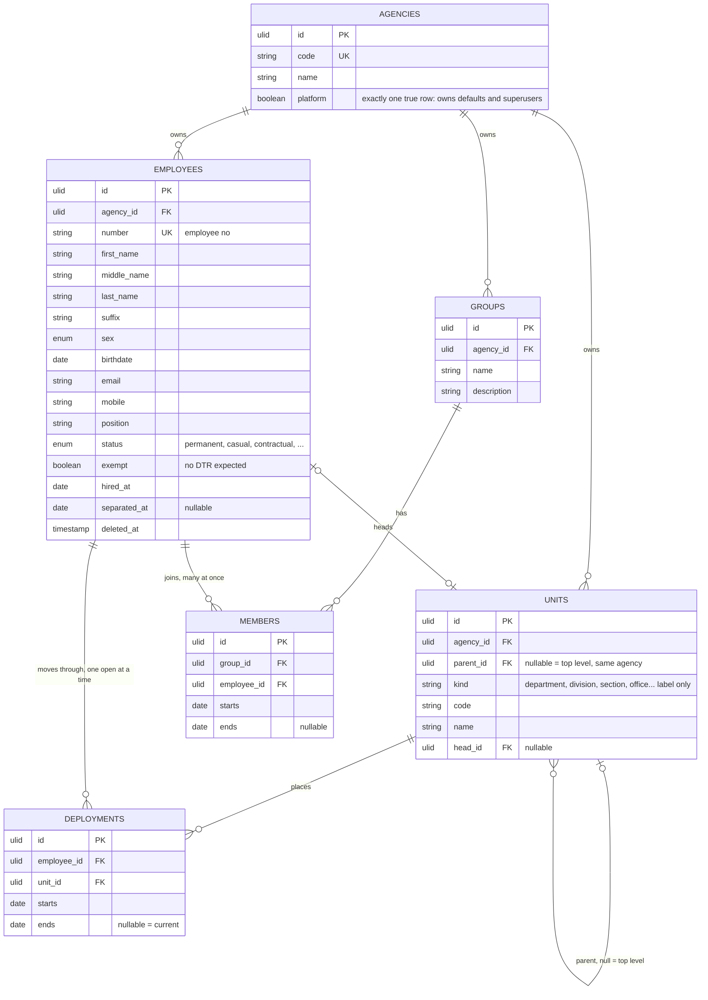

# 01 — organization



## Rules

1. A unit's parent is null or another unit of the same agency, enforced by a paired FK on `(parent_id, agency_id)`. No cycles, enforced by trigger.
2. An employee has at most one deployment per date: exclusion constraint on `employee_id` and `daterange(starts, ends)`, which also yields at most one open deployment.
3. Exactly one agency row has `platform` true, enforced by a partial unique index. It owns the shared rows: national holidays, default shifts and schedules, superusers. It has no employees, units, terminals or groups, enforced by trigger, cannot be deleted, and the flag cannot move. Eloquent hides it from `Agency` queries with a global scope; it is reached through `Agency::platform()`, so lists, counts and reports never see it.
4. "This unit and everything under it" is a recursive CTE over `parent_id`.
5. Units are the formal structure, one placement at a time. Groups are generic, cross-cutting containers: an employee may be in many. They exist for filtering and bulk actions such as rostering every member at once. A group owns nothing.

## Shapes it covers

```
Agency A                          Agency B                  Agency C
  Treasury       department         Admin      division       Engineering  department
    Collection   division             employees here            employees here
      employees here
```
