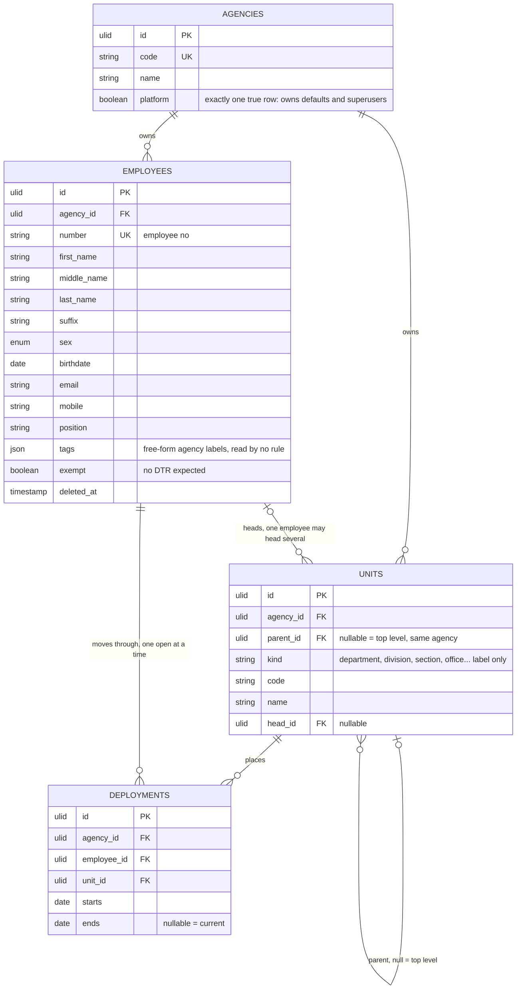

# 01 — organization



## Rules

1. A unit's parent is null or another unit of the same agency, enforced by a paired FK on `(parent_id, agency_id)`. No cycles, enforced by trigger.
2. An employee has at most one deployment per date: exclusion constraint on `employee_id` and `daterange(starts, ends, '[]')`, which also yields at most one open deployment.
3. Exactly one agency row has `platform` true, enforced by a partial unique index. It owns the shared rows: national holidays, default shifts and schedules, superusers. It has no employees, units, terminals or teams, enforced by trigger, cannot be deleted, and the flag cannot move. Eloquent hides it from `Agency` queries with a global scope; it is reached through `Agency::platform()`, so lists, counts and reports never see it.
4. "This unit and everything under it" is a recursive CTE over `parent_id`.
5. Units are the formal structure: one placement at a time, through `Deployment`. Tags are labels on the employee — free-form, agency-defined, read by no rule — and the way you select many employees at once for an ad-hoc bulk action. A `Team` (04-scheduling.md) is a named `(schedule, anchor)` cohort and is the only one of the three that decides what a person is expected to work. A fact you filter by is a tag; a rotation you belong to is a team. `meta` is inert payload nothing filters on.

6. Deployment ranges are the employment history (decision 28). An open deployment means current employment; the first start and final end record the span, and a new range after a gap records rehire without overwriting earlier service. A person with no placement is not yet started for timekeeping. Tags may distinguish departure from a gap, but no computation reads them. Ending a placement includes its last day and opens no replacement. Removal closes a started open placement on today, deletes a never-started open placement, and then soft-deletes the employee in the same transaction.

## Shapes it covers

```
Agency A                          Agency B                  Agency C
  Treasury       department         Admin      division       Engineering  department
    Collection   division             employees here            employees here
      employees here
```
