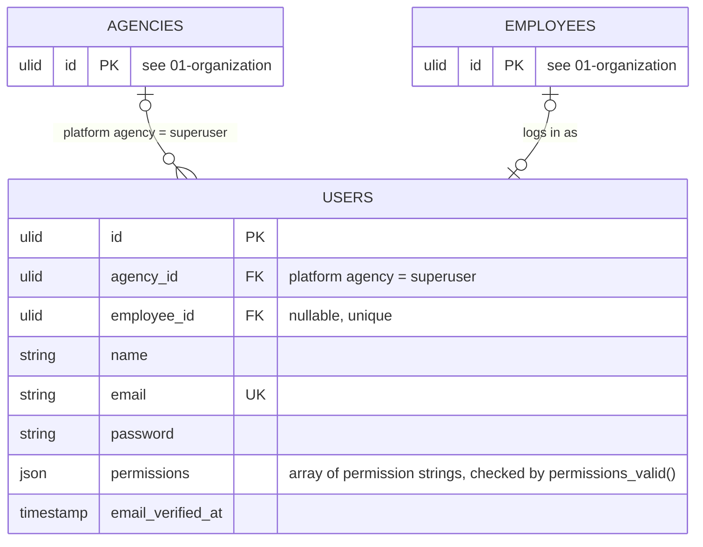

# 02 — access

## Rules

1. One authenticatable model. `Employee` is the HR record and never logs in by itself.
2. A user with an `employee_id` sees their own workdays and ledgers. Without one, the user is staff of the agency.
3. A user of the platform agency is a superuser. They manage agencies and defaults, and can enter any agency; inside it every query scopes to that agency exactly as for its own staff, so tenant scoping has one code path: the chosen agency for platform users, the own agency for everyone else. The platform agency has no employees, so the paired FK on `(employee_id, agency_id)` already forbids linking a superuser to a person.
4. Access is a set of permissions on the user, not a role. `permissions` is a jsonb array of strings from one PHP enum, checked by `permissions_valid()` (array, strings, distinct). v1 set, `manage` implies `view`: `agency.manage`, `users.manage`, `organization.view|manage`, `scheduling.view|manage`, `calendar.view|manage`, `terminals.view|manage`, `ledgers.view|manage|attest`. Presets (Admin, HR, Viewer) are convenience bundles in code for the invite form, never stored. Superuser is the platform flag, supervisor and head come from `Unit.head_id`; the attestation role `hr` means any user of the agency holding `ledgers.attest`.
