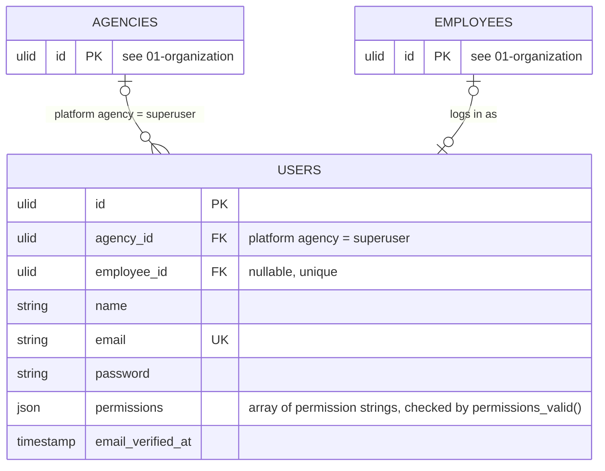

# 02 — access

## Rules

1. One authenticatable model. `Employee` is the personnel record and never logs in by itself.
2. A user with an `employee_id` sees their own workdays and ledgers. Without one, the user is staff of the agency.
3. A user of the platform agency is a superuser. They manage agencies and defaults, and can enter any agency; inside it every query scopes to that agency exactly as for its own staff, so tenant scoping has one code path: the chosen agency for platform users, the own agency for everyone else. The platform agency has no employees, so the paired FK on `(employee_id, agency_id)` already forbids linking a superuser to a person.
4. Access is a set of permissions on the user, not a role. `permissions` is a jsonb array of strings from one PHP enum, checked by `permissions_valid()` (array, strings, distinct). v1 set, `manage` implies `view`: `agency.manage`, `users.manage`, `organization.view|manage`, `scheduling.view|manage`, `calendar.view|manage`, `terminals.view|manage`, `ledgers.view|manage|attest`. Presets (Admin, Timekeeper, Viewer) are convenience bundles in code for the invite form, never stored. Superuser is the platform flag, supervisor and head come from `Workgroup.head_id`; the attestation role `timekeeper` means any user of the agency holding `ledgers.attest`.
5. **Visibility will be workgroup-scoped, not agency-wide** (decision 30, not yet implemented). Every permission in rule 4 is agency-wide today and no policy carries a workgroup dimension, so any holder of `ledgers.view` sees every ledger in the agency. That is wrong for a timekeeper assigned to one workgroup: an employee being there now must not expose the records they made elsewhere. The grain is the **month**, because the ledger is monthly. The predicate is *overlap*, not containment:

   > A timekeeper sees a ledger if **any** deployment of that employee, in a workgroup they cover, overlaps the ledger's month.

   So a mid-month move splits the month between two workgroups and **both** see that month — acceptable, because a partial month is still that month's DTR and the alternative is a form nobody can complete. What is not acceptable, and what this rule exists to stop, is one workgroup seeing an employee's records from months that workgroup never held them.

   Consequences, each of which is a decision in its own right:

   - `ledgers` carries **no** `deployment_id` and no scoping `workgroup_id`. A single FK would hand a split month to exactly one workgroup, breaking the rule above; a stamped *set* of workgroups would cache what the deployment ranges already answer. The ledger may stamp a workgroup for CS Form 48's office field — the one covering the last day of the month — and that field is **display only**, never an access input.
   - **Deployment ranges become access control.** Their integrity stops being a data-quality concern and becomes a security property: a wrongly extended range grants a workgroup a window of records it must not see.
   - Month grain dissolves the coverage-gap problem. At day grain a gap orphans records no scoped timekeeper can see, attest or correct; at month grain any overlap inside the month grants access, so a gap must swallow an entire month untouched by any other deployment before anything is orphaned.
   - **The workgroup tree has no history.** `workgroups.parent_id` is current state, so if scoping reaches the subtree, reparenting a section retroactively changes who can see the past and nothing records that it used to sit elsewhere. Known limitation, deliberately unsolved: reparenting is rare and deliberate, and date-ranging the tree costs more than it returns. Recorded so the first reader to notice finds the answer instead of filing a bug.
   - Agency-wide reach must be an **explicit grant**, never the absence of a restriction. `AgencyScope` is fail-closed — it throws rather than returning empty — and a scoping model that defaults to unscoped for users with no assignment would contradict that in the one place it matters most.
   - The likely shape is a `workgroup_user` pivot: the permission says *what*, the pivot says *which rows*. Whether it is enforced in the application or by Postgres row-level security is open; `chronoz` is not superuser, so RLS would genuinely bind, and it is the only version in which a forgotten `->where()` cannot leak a record.
   - The first leak to close is not the ledger. `EmployeeController::show` loads the whole deployment history unscoped and `employees/index` lists every employee of the agency — those are where an employee's full record is visible today.
   - Indexing: the deployment exclusion constraint's gist index covers `(employee_id, range)`, but this predicate leads with `workgroup_id`.
