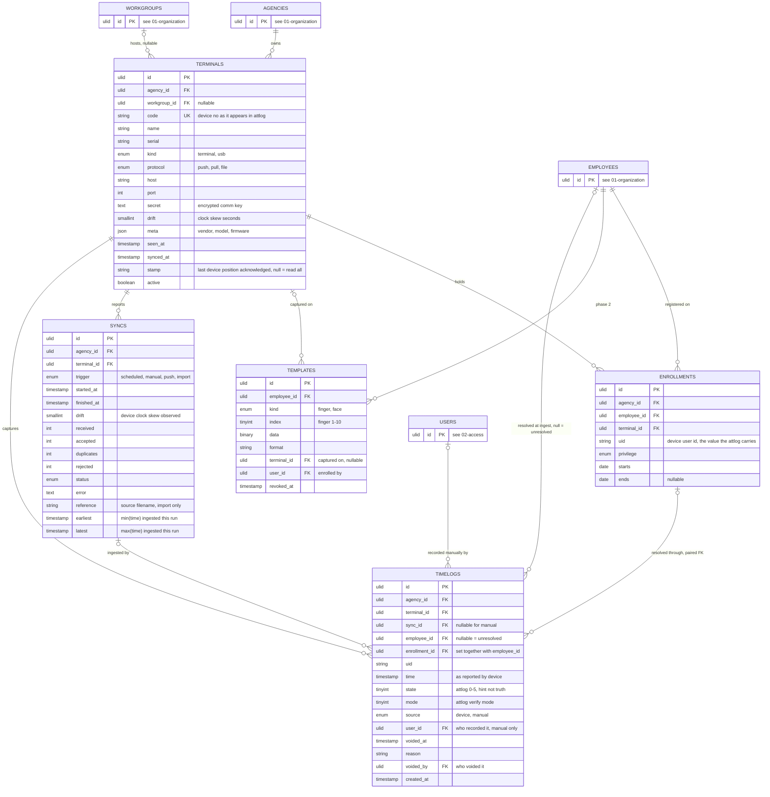

# 03 — terminals and ingestion

## Rules

1. A timelog is immutable. Bad timelogs get `voided_at`, `reason` and `voided_by`. Nothing is ever pruned. Enforced by privilege: the app role cannot delete and can only update those three columns (07-constraints.md) — `user_id` is deliberately outside the grant, so a void can never rewrite whose punch it was. **A void is also final**, which privilege cannot say: with all three columns writable, a second void would be a legal UPDATE overwriting the first one's timestamp, reason and actor, so `timelogs_void_is_final` refuses every update of an already-voided row (decision 48).
2. Natural key: unique on `terminal_id, uid, time, state, mode`. Import is `INSERT ... ON CONFLICT DO NOTHING` on it; inserted rows are `accepted`, skipped rows `duplicates`. Only accepted rows trigger workday recompute.
3. `employee_id` and `enrollment_id` are set by the database, not the app. A `BEFORE INSERT` trigger picks the enrollment covering `terminal_id, uid, time::date`; the exclusion constraints on enrollments guarantee there is at most one. A paired FK on `(enrollment_id, employee_id, terminal_id, uid)` stays as a second lock. Null means unresolved and stays visible. Creating or moving an enrollment re-resolves the affected timelogs by trigger; the app then queues recompute for the touched employee-dates.
4. `sync_id` gives every device timelog its ingestion time and the clock drift observed in that run. `drift` is a measurement for alerts and disputes, never a correction; `time` is never adjusted. Manual timelogs have no sync, carry `source = manual`, and require `user_id`.
5. `Terminal.stamp` is the read offset for incremental pull and push; the upsert is what makes re-reading harmless. Resetting `stamp` to null forces a full resync.
6. `state` and `mode` are stored as the raw attlog integers. Enums cast with `tryFrom`; an unknown value stays a plain int and is never written back.

## attlog enumerations

| state | meaning | | mode | meaning |
|---|---|---|---|---|
| 0 | check in | | 0, 1 | fingerprint |
| 1 | check out | | 2, 4 | card |
| 2 | break out | | 3 | password |
| 3 | break in | | 15, 16 | face |
| 4 | overtime in | | | |
| 5 | overtime out | | | |

Labels for `mode` to be validated against the device manual; the integers stay as the device sends them.

## Open items

1. **How a manual timelog resolves.** Rule 3 makes `employee_id` the database's job, and
   `timelogs_resolve()` finds the enrollment covering `(terminal_id, uid, time::date)` — so a manual
   entry needs the employee already enrolled on the terminal it names, and there is no path to record
   a punch for someone who never was. That is self-consistent but was never stated, and nothing
   decides it: M5 ships the schema for `source = 'manual'` (the CHECKs requiring `user_id` and
   forbidding a `sync_id`) but no manual writer. Settle it when the writer is built — the question is
   whether `terminal_id` should be nullable for a manual row, which would change the natural key.
2. **The read offset on a shared device.** `stamp` is per terminal, so two agencies sharing one
   physical device (the predecessor allowed it) would share a read position. khronoz's terminals are
   per-agency by `agency_not_platform`, so the case cannot arise today; it returns if device sharing
   is ever asked for.
