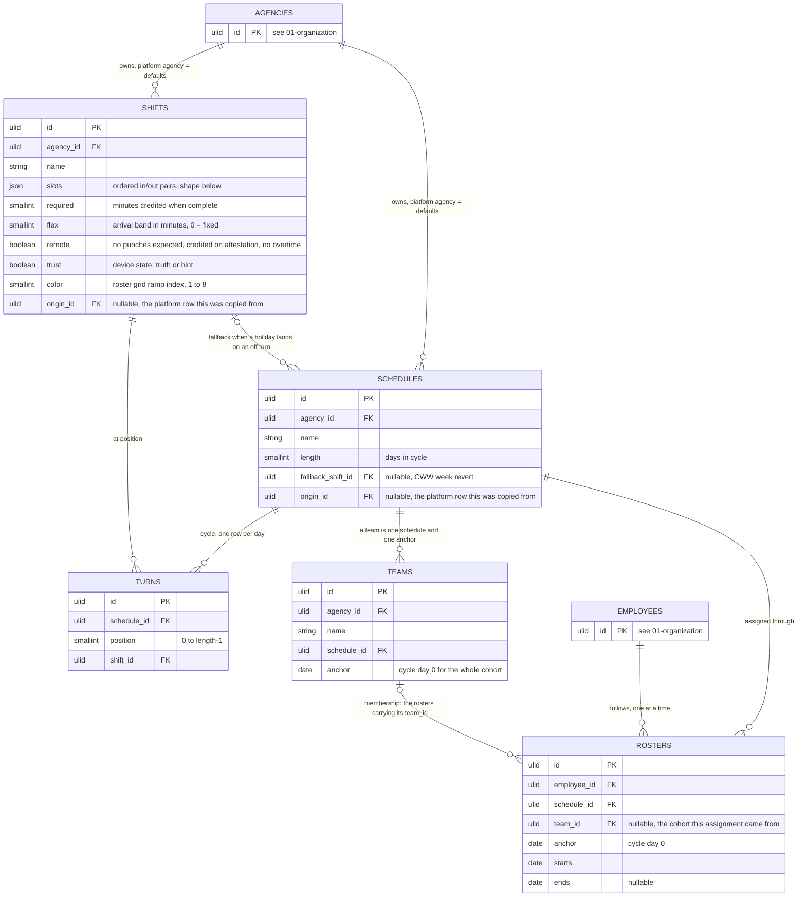

# 04 — scheduling



## The five words

- **Shift**: a day template. `Off` is a shift with no slots. `Remote` is a shift with no slots and `remote` true.
- **Schedule**: a repeating cycle of shifts. Turns are its days, in order.
- **Roster**: employee follows schedule from `starts` to `ends`, with the cycle anchored at `anchor`. This is the only assignment. Direct FK, no polymorphism.
- **Team**: a named `(schedule, anchor)` cohort. Three hospital teams are one schedule and three anchors. A team has no members of its own — the rosters carrying its `team_id` *are* its membership, so who was on it in March is answerable from their date ranges, and one employee on two teams at once is already impossible.

Rostering many at once has two shapes. A rotation cohort is a `Team`: assigning it writes one roster per employee, each copying the team's schedule and anchor and pointing back with `team_id`. An ad-hoc set is a tag filter plus select-all, writing rosters with `team_id` null. Either way resolution reads one roster row, and an exception is just a roster of its own.

## Resolution for employee E on date D

1. Find E's roster covering D.
2. `position = (D - roster.anchor) mod schedule.length`
3. The turn at that position gives the shift. No roster means no expected shift; the workday just lists raw timelogs.
4. Expected punch times come from the slots. A time past 24:00 falls on a later date, so the workday of D owns the `"30:00"` out that the device records at 06:00 on D+1. `flex` slides every expected time by the first in's offset, capped at `flex`.

## Slot shape

```json
{ "in": "08:00", "out": "12:00", "grace": 0, "window": [-240, 180] }
```

| Key | Meaning |
|---|---|
| `in`, `out` | expected times |
| `"30:00"` | hours past 24 roll into the following days, like a transit timetable: `"30:00"` is 06:00 the next day, `"56:00"` is 08:00 two days on. Cap 72:00. Replaces the `overnight` flag |
| `grace` | minutes after `in` still counted on time. CSC has none; agency choice, default 0 |
| `window` | minutes before `in` and after `out` in which a timelog may still match this slot |

The count of pairs is free: one for a straight shift, two for a day with lunch, more if an agency punches breaks. The shape of each pair is fixed and checked by a CHECK constraint calling a SQL function (07-constraints.md). The workday copies the whole shift, slots included, into its `shift` snapshot; there is no second slots column.

Matching: a timelog goes to the nearest expected side whose window covers it. Inside a slot, before the midpoint is `in`, after is `out`, unless `trust` and the device state say otherwise — and those two are the same rule, since the midpoint is exactly where the nearer side stops being the in. Where several timelogs compete for one side the **nearest** fills it; only when two are equidistant does the kind decide, `in` taking the earlier and `out` the later (decision 67, which supersedes a bare "first wins for `in`, last for `out`" — read greedily that makes a stray 19:31 tap the departure of a 17:00 shift). A timelog that loses its nearest side is unused and does not cascade to another. The full daily rules are in 06-attendance.md.

## Examples

Times are `in`–`out`; `w` is the window.

**Standard 8–5, Rule XVII §5.** Shift `Standard`, required 480.

```json
[ { "in": "08:00", "out": "12:00", "window": [-240, 180] },
  { "in": "13:00", "out": "17:00", "window": [-120, 300] } ]
```

Schedule `Standard week`, length 7: Standard ×5, Off ×2. One roster per employee, anchor on a Monday.

**Flexitime, MC 06 s. 2022, arrival 07:00–10:00.** Shift `Flexi`, required 480, `flex` 180.

```json
[ { "in": "07:00", "out": "11:00", "window": [-30, 240] },
  { "in": "12:00", "out": "16:00", "window": [-60, 360] } ]
```

Arrive 08:23: offset 83, expected becomes 08:23–12:23 and 13:23–17:23. Arrive 10:30: offset capped at 180, expected 10:00–14:00 and 15:00–19:00, tardy 30. Arrive 06:30, before the band opens: offset **0**, expected stays 07:00–11:00 and 12:00–16:00 (decision 59). The offset floors at zero — flexitime grants an arrival band, not a free choice of workday, so an early arrival cannot manufacture an early departure. Those minutes are not lost: they are early presence and accrue as `excess` like any other. Same `Standard week` schedule with Flexi in place of Standard.

**Compressed work week, Res. 2600838.** Shift `Long`, required 600.

```json
[ { "in": "07:00", "out": "12:00", "window": [-240, 180] },
  { "in": "13:00", "out": "18:00", "window": [-120, 300] } ]
```

Schedule `CWW Mon–Thu`, length 7: Long ×4, Off ×3, `fallback_shift_id` = Standard. Variant under OP MC 114: Long ×4, Remote ×1, Off ×2, where `Remote` has `remote` true and no slots.

**Hospital, three 8-hour shifts rotating weekly, RA 7305.** Three shifts, each one slot, required 480.

```json
Morning    [ { "in": "06:00", "out": "14:00", "window": [-120, 120] } ]
Afternoon  [ { "in": "14:00", "out": "22:00", "window": [-120, 120] } ]
Night      [ { "in": "22:00", "out": "30:00", "window": [-120, 120] } ]
```

Schedule `Rotation`, length 21: Morning ×5, Off ×2, Afternoon ×5, Off ×2, Night ×5, Off ×2. Team A anchor 7 Sep, Team B 14 Sep, Team C 21 Sep, all on the same schedule. On any date the three teams sit 7 positions apart, so every shift is covered. The Night workday of 8 Sep owns the 06:00 timelog of 9 Sep. A night shift with a punched break is two pairs, 22:00–26:00 and 26:00–30:00.

**12-hour shifts, nurses or guards, 2 days 2 nights 4 off.** Two shifts, required 720.

```json
Day12    [ { "in": "06:00", "out": "18:00", "window": [-120, 120] } ]
Night12  [ { "in": "18:00", "out": "30:00", "window": [-120, 120] } ]
```

Schedule `12h 2-2-4`, length 8: Day12 ×2, Night12 ×2, Off ×4. Four teams, anchors 2 days apart. Every day has one team on Day12 and one on Night12.

**Civil Security Unit, 24-hour duty, 24 on 48 off.** Shift `Duty24`, required as the agency credits it.

```json
[ { "in": "08:00", "out": "32:00", "window": [-60, 60] } ]
```

Schedule `24/48`, length 3: Duty24, Off, Off. Three guards per post, anchors 1 day apart. A 48-hour duty is the same slot with `"out": "56:00"` and a schedule of length 4 or 5; the shape allows it, the workday of the first day owns the out two days later.

**Ramadan, Res. 81-1277 and 00-0227.** Shift `Ramadan`, required 480, one slot 07:30–15:30, no lunch punch; Fridays 10:00–14:00 come from an Exemption with `starts` and `ends`, not from a shift. The Ramadan shift is a one-month roster that ends the standing roster (rule 3).

## Rules

1. One roster per employee per date. Postgres exclusion constraint on `employee_id` and `daterange(starts, ends, '[]')`; overlapping rosters cannot be written.
2. Editing a shift or schedule changes future computation only. Workdays keep a snapshot of the shift they were computed against.
3. A one-week override is a one-week roster. The exclusion constraint forces you to end the standing roster first, which is the right paper trail.
4. A schedule's turns must be complete: exactly `length` rows, positions 0 to `length - 1`. Deferrable constraint trigger, 07-constraints.md.
5. `fallback_shift_id`: when a holiday or suspension lands on an Off turn, the other turns of that ISO week resolve to the fallback shift, prospectively from `declared_at` (Res. 2600838 §2.3 and §2.5). Recompute for such rosters widens from the date to the week.
6. A `remote` shift expects no punches. The day is credited on attestation and never yields overtime (Flexiplace, OP MC 114).
7. Platform-owned shifts and schedules are readable by every agency, copied into each new agency at onboarding and on demand later. `origin_id` points at the platform row, so the UI shows when a copy has diverged and can refresh it on request. A roster can only reference a schedule of its own agency, which the paired FK enforces.
8. `color smallint NOT NULL` is the shift's slot in the roster grid's fixed eight-colour ramp, stored on the row and never derived from the name or the id. A new shift takes the lowest index its agency is not already using and wraps at 8; the timekeeper may change it; a copy from the platform agency carries the origin row's index. `Off` and `Remote` are drawn from empty `slots` and the `remote` flag, so their index is never read. Range 1 to 8 is a database check with the other shift constraints (07-constraints.md); the ramp itself is in 08-interface.md (decision 21).
