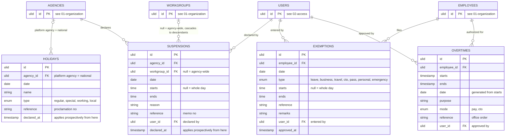

# 05 — calendar: holidays, suspensions, exemptions, overtimes

What changes the expectation set by the roster: less work expected, or more work authorized.

## How they change a workday, in order

1. **Holiday** on the date, regular or special non-working: no work expected. Work done is excess, compensable only under an Overtime authority at the holiday rate. `working` type keeps the shift. On a compressed-week Long turn the day is deemed complied, worked = required (Res. 2600838 §2.4). On an Off turn of a compressed week the other turns of that ISO week fall back to `Schedule.fallback_shift_id` (§2.3).
2. **Suspension** covering the employee's workgroup: slots from `starts` on are not expected. Whole-day suspension behaves like a holiday. An employee with no punch before `declared_at` is absent for the part of the shift before `starts` (Omnibus Rules on Leave §32).
3. **Exemption** for the employee: the covered period, or the whole day when `starts` is null, is excused: not tardy, not undertime, not absent. `personal` is the exception, it excuses nothing (rule 7). `travel` also suppresses excess (JC 2 s. 2015 §7.3).
4. **Overtime** for the employee: work outside the shift and inside `starts`–`ends` is compensable excess. Without an authority, excess is recorded and never compensable.
5. Otherwise the shift stands.

## Rules

1. A holiday owned by the platform agency applies to every agency. Local holidays carry their agency. Lookup is `agency_id IN (own, platform)`.
2. `declared_at` on holidays and suspensions is the moment the declaration took effect. Workdays before it are not recomputed by the declaration (Res. 2600838 §2.5); a compressed-week fallback applies to turns after it. The timekeeper may enter the memo's own time.
3. A suspension on a workgroup applies to every employee deployed under it or its descendants on that date.
4. Exemptions replace the old `am / pm / full` with times, so a Friday prayer 10:00–14:00 that crosses noon, a two-hour pass slip and a 40-minute lactation break are all one shape. AM and PM are just times.
5. Exemptions and overtime authorities are timekeeper-entered in v1 from the office order or approved form, `approved_at` set on entry. Filing and approval workflows are phase 2.
6. Overtime authority gates from JC 2 s. 2015 are constants, not settings: the employee must have arrived on time, rendered at least two hours beyond the shift on a workday, and at most twelve hours on a rest day or holiday. Overtime never offsets undertime (§10.4). Payroll applies 1.25 and 1.5, or COC 1.0 and 1.5, from the `mode` and whether the date was a scheduled workday.
7. `personal` is recorded and printed but never excuses minutes. A personal pass slip, also called a locator or OB slip, leaves the day's tardiness, undertime and absence exactly as the punches make them; the minutes are charged to leave (Omnibus Rules on Leave §34). Every other type excuses the window it covers, whole day when `starts` is null. `Exemption::excused(): bool` is the one place that decides, false only for `personal`; the deriver consults it (06-attendance.md daily rule 7). The official-business slip stays `pass`. Type set: `leave, business, travel, cto, pass, personal, emergency` (decision 19).
