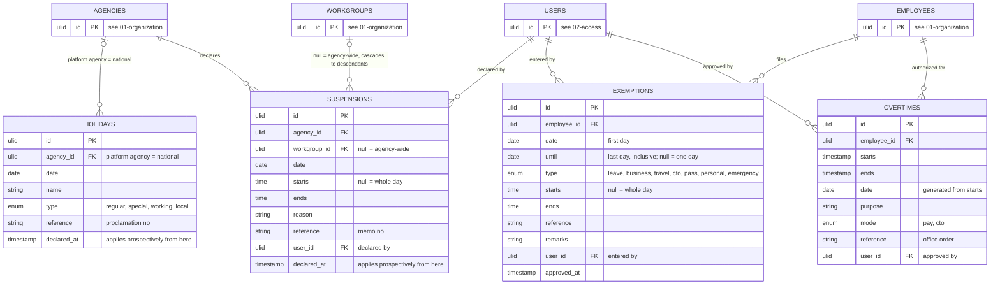

# 05 — calendar: holidays, suspensions, exemptions, overtimes

What changes the expectation set by the roster: less work expected, or more work authorized.

## How they change a workday, in order

1. **Holiday** on the date: `HolidayType::expectsWork()` is the one place that decides, and it is false for `regular`, `special` and `local`, true for `working` (decision 49). A `local` holiday is one declared by ordinance and behaves as `special` — Philippine practice treats it that way unless the ordinance says otherwise, and leaving the fourth value of the type set unstated meant a deriver either raised on it or silently ran an ordinary day. `working` keeps the shift. Where no work is expected, work done is `excess`, compensable only under an Overtime authority at the holiday rate — **except** where `settings.premium_hours` is set, under which the first 480 minutes become `credited` at the Arts. 93–94 premium and only the rest is excess (decision 51, 06-attendance.md daily rule 10). On a compressed-week Long turn the day is deemed complied, worked = required (Res. 2600838 §2.4). On an Off turn of a compressed week the other turns of that ISO week fall back to `Schedule.fallback_shift_id` (§2.3).
2. **Suspension** covering the employee's workgroup: slots from `starts` on are not expected. Whole-day suspension behaves like a holiday. An employee with no punch before `declared_at` is absent for the part of the shift before `starts` (Omnibus Rules on Leave §32).
3. **Exemption** for the employee: the covered period, or the whole day when `starts` is null, is excused: not tardy, not undertime, not absent. `personal` is the exception, it excuses nothing (rule 7). `travel` also suppresses excess (JC 2 s. 2015 §7.3). Where two cover one day, minutes are excused from both and the workday stamps one by precedence (decision 50).
4. **Overtime** for the employee: work outside the shift and inside `starts`–`ends` is compensable excess. Without an authority, excess is recorded and never compensable.
5. Otherwise the shift stands.

## Rules

1. A holiday owned by the platform agency applies to every agency. Local holidays carry their agency. Lookup is `agency_id IN (own, platform)`.
2. `declared_at` on holidays and suspensions is the moment the declaration took effect. Workdays before it are not recomputed by the declaration (Res. 2600838 §2.5); a compressed-week fallback applies to turns after it. The timekeeper may enter the memo's own time.
3. A suspension on a workgroup applies to every employee whose **operative** deployment on that date is under it or its descendants — the movement if one covers the date, otherwise the substantive placement (01-organization.md rule 7, decision 31). Not "every employee deployed under it": during a detail both rows are open, so that wording would let a closure declared on the mother workgroup excuse a day the person actually worked in the receiving one. Implemented as `Employee::operativeDeployment(date)` for one person and `Suspension::appliesTo()` for the set, the latter written in three clauses — movement in the subtree, or no movement and placement in the subtree — because the negative clause is the whole rule and the easiest thing to drop. An **agency-wide** suspension (`workgroup_id` null) needs neither: it reaches everyone deployed on the date, and because a movement always nests inside its placement, "any deployment covering the date" is the same set as "employed on the date".
4. Exemptions replace the old `am / pm / full` with times, so a Friday prayer 10:00–14:00 that crosses noon, a two-hour pass slip and a 40-minute lactation break are all one shape. AM and PM are just times. In the other direction, a **continuous statutory leave is one row**, running `date` to `until` with both bounds inclusive and both NOT NULL (decisions 37 and 38). RA 11210's 105 days for a live birth spans rest days and holidays, so it cannot be a run of per-workday rows; the range covers them and they are already off. A one-day exemption carries `until = date`; there is no open-ended exemption, because an authority always names its last day, and a nullable `until` would have made `daterange(date, until, '[]')` unbounded above and read a two-hour pass slip as excusing the rest of a career. A multi-day exemption is always whole days: hours plus a span is refused, because a 10:00–14:00 window repeated across 105 days would under-excuse a statutory entitlement by two thirds. Counting the days is entitlement arithmetic and out of v1 (decision 32) — khronoz records the range the order grants and never polices the total.
5. Exemptions and overtime authorities are timekeeper-entered in v1 from the office order or approved form, `approved_at` set on entry. Filing and approval workflows are phase 2.
6. Overtime authority gates from JC 2 s. 2015 are one setting and not four constants (decision 83, superseding "constants, not settings"): the employee must have arrived on time, rendered at least two hours beyond the shift on a workday, and at most twelve hours on a rest day or holiday — and the authority itself must cover the minutes (daily rule 6, decision 79). All four are §10's conditions and `settings.overtime_gates` switches them off together, default `true`. Under the Labor Code none of them holds: Art. 87 makes work beyond the prescribed hours overtime by operation of law, Art. 88 forbids offsetting it against undertime, and `../reference/dole-rules.md` section G records that a private employer authorises overtime by their own act, so the authority row is optional there. They were constants because M5 had no reader for them; they are a setting now because applying them to a private employer reported zero overtime on a day somebody worked twelve hours. Overtime never offsets undertime (§10.4). Payroll applies 1.25 and 1.5, or COC 1.0 and 1.5, from the `mode` and whether the date was a scheduled workday.
7. `personal` is recorded and printed but never excuses minutes. A personal pass slip, also called a locator or OB slip, leaves the day's tardiness, undertime and absence exactly as the punches make them; the minutes are charged to leave (Omnibus Rules on Leave §34). Every other type excuses the window it covers, whole day when `starts` is null. `Exemption::excused(): bool` is the one place that decides, false only for `personal`; the deriver consults it (06-attendance.md daily rule 7). The official-business slip stays `pass`. Type set: `leave, business, travel, cto, pass, personal, emergency` (decision 19).
