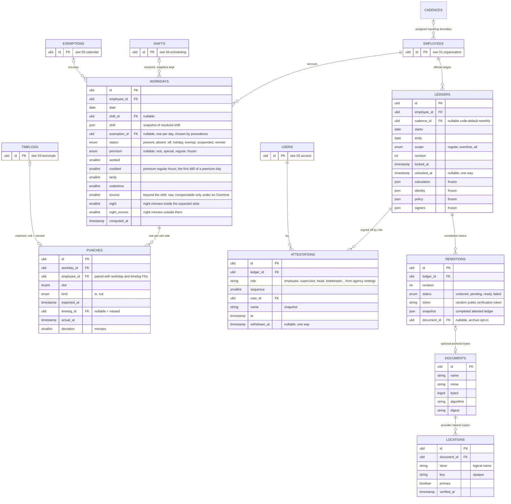

# 06 — attendance: workdays, punches, ledgers



## The chain, one day

`timelogs → punches → workdays → ledgers` is one pipeline with receipts kept in the middle.

| Table | One row is | Answers |
|---|---|---|
| Timelog | a raw fact: uid 42 touched device 3 at 07:58:12, state 0, mode 1 | what the device saw |
| Punch | one expected slot side of one workday, and the timelog that filled it, or null | which fact counted for which slot |
| Workday | employee E on date D: the shift snapshot plus the derived minutes and status | the DTR line |
| Ledger | employee E over an explicit date range and work scope, at one lock revision | what was frozen for attestation |
| Rendition | one completed application-attestation chain over that ledger | what a QR verifies |
| Document | immutable bytes optionally archived for an opted-in agency | what exact file was retained |
| Location | one verified physical copy of a document through a logical store | where those bytes can be resolved |

Employee E, Standard shift, 8 Sep 2026. Terminal holds five timelogs for uid 42 that day: 07:58, 07:58 (double tap), 12:03, 17:05, 19:31.

| Punch | slot | kind | expected | timelog | actual | deviation |
|---|---|---|---|---|---|---|
| 1 | 1 | in | 08:00 | 07:58 | 07:58 | -2 |
| 2 | 1 | out | 12:00 | 12:03 | 12:03 | +3 |
| 3 | 2 | in | 13:00 | null | | missed |
| 4 | 2 | out | 17:00 | 17:05 | 17:05 | +5 |

The double tap and the 19:31 timelog stay in `timelogs`, unused. The workday reads: present, worked 480 less the missed slot per the agency rule, tardy 0, undertime 0, raw excess 5 with no `Overtime` authority so nothing compensable. The ledger for September collects that row with the other 21.

Timelog to Workday is many to many in principle, since an overnight shift can draw from two dates and a day draws from many timelogs. Punch is the resolution: exactly one timelog, or none, per slot side. Clockwork kept this in a json whose shape changed by case; a table gives a foreign key back to the timelog, a fixed shape, and a query for "every missed afternoon-in this month".

## Across midnight and month end

The workday of date D owns every punch of the shift that starts on D, including an out that the device records on D+1 or D+2. Punches carry full timestamps in `expected_at` and `actual_at`, so nothing is lost when the date differs from `workday.date`.

Night shift 22:00–30:00 on 30 September, out recorded 1 October 06:00:

| Fact | Where it lives |
|---|---|
| timelog 2026-10-01 06:00 | `timelogs`, dated October, untouched |
| punch slot 1 out, expected 2026-10-01 06:00, actual 06:00 | `punches`, row of the 30 September workday |
| workday 2026-09-30, `month` 2026-09-01 | September ledger, by the generated `month` |
| 1 October workday | its own shift only; the 06:00 timelog is already claimed |

Rules:

1. A timelog at time T can only belong to a workday dated T::date − 3 to T::date, the 72:00 slot cap. Recompute for that employee runs over those dates in order, so the earlier workday claims first. The unique index on `punches.timelog_id` makes a second claim impossible.
2. A report owns a workday by its duty date. An official range ending 30 September is complete only after the 1 October 06:00 out for the 30 September duty has arrived; recompute must not skip a workday because the timelog's calendar month differs.
3. Locking waits for the outs. A ledger cannot be inserted while any required out in its range is still pending, and the range cannot lock before its final Manila calendar day; trigger `ledgers_lock_complete` in 07-constraints.md.
4. **Status follows the day the duty started, and is never split** (decision 54). `status` and `premium` are one value each per row, so a 22:00 Sunday shift running into a Monday that is a regular holiday records Sunday's classification and nothing else. That is the paper form's own convention — the 48-hour example below puts forty October hours in September's totals for the same reason. Calendar-day attribution of *rates*, where payroll needs the 360 minutes that fell on Monday, is derived from `punches.actual_at` against dated holiday rows and never stored; the holidays consulted at compute time are frozen into the snapshot. The legal premise is a **default, not an invariant** — a contract, policy or CBA may attribute a whole night shift to the evening it began — so the other reading becomes a setting selecting between two stated policies when a real agency needs it, which costs nothing because the full timestamps survive.

## CSC Form 48

The form is one optional renderer of the ledger view, not the storage and not an employment-status rule. Khronoz uses Clockwork's traditional one-sided Form 48 layout as the visual reference while retaining its expanded columns: day; AM in and out; PM in and out; tardiness, undertime, and total deficit; hours worked; overtime hours; and remarks or adjustments. Day and time figures are tabular, day values align right, and the four punch, three deficit, hours-worked, and overtime columns share a consistent numeric rhythm. Every month prints 31 body rows; impossible dates use the same excluded-range treatment and show `--` in the day column. The employee-number line is omitted when the frozen identity has no number.

An unscheduled Saturday, Sunday, or holiday merges only the four AM and PM punch cells and prints its calendar labels there. Weekend and multiple holiday labels are combined in order with a bullet separator, such as `Sunday • New Year's Day • Local Foundation Day`. Deficit, hours worked, overtime, day, and remarks remain separate. Holidays state their frozen classification in remarks, such as regular, special non-working, special working, or local holiday. A scheduled weekend or holiday remains cell-by-cell so no expected, missing, or actual punch is concealed. Weekend rows use a light solid grey fill across the complete row, holiday rows add a stripe, and a date that is both receives both treatments. Excluded-range or impossible-date rows use a distinct stipple. Weekly-only overtime is printed on the Sunday that owns the weekly calculation.

| Slots in the shift | Printed as |
|---|---|
| 1 pair | each side in the column its own clock time falls in, AM before 12:00 and PM from 12:00, with the side taken from the punch `kind`: 08:00–17:00 prints an AM arrival and a PM departure, 22:00–06:00 prints a PM arrival and an AM departure `06:00⁺¹`. The two unused columns stay blank |
| 2 pairs | by clock when the four punches fall in four different columns, which is the ordinary day, 08:00–12:00 and 13:00–17:00. When they do not, because both pairs sit in the same half of the day, the four columns are positional: slot 1 takes the first pair of columns, slot 2 the second. An afternoon shift of 14:00–18:00 and 19:02–22:00, and a night shift of 22:00–02:00⁺¹ and 03:00⁺¹–06:00⁺¹, both print this way |
| 3 or more | first in and last out occupy the four conventional time columns; every intermediate punch remains printed as a deterministic annotation in remarks so the PDF does not drop data |
| a punch dated after the workday | the time with a day marker, `06:00⁺¹`, `08:00⁺²` |
| whole-day exemption | the exemption `type`, or its `reference` when the exemption carries an order number, across the four time columns |
| partial exemption | the punches as usual, with the excused side marked |
| missed punch | blank |
| punch whose `expected_at` is still in the future | `…`, pending, never missed |
| Off day inside a duty that started earlier | blank, status `off`; the hours are on the start day |
| deficit columns | tardiness and undertime remain separate `HH:MM` figures; total is their sum for that day |

Placement by clock time (decision 23) supersedes the earlier rule that a one-pair shift printed its arrival in the first column and its departure in the last, which put a 22:00 arrival in the AM column. The paper form asks for a time under a heading, so the heading is read literally wherever the day's punches allow it. They do not always allow it: the form carries four time columns, and two pairs inside one half of the day cannot be split across headings that do not exist, so those fall back to the positional layout. Every punch that belongs to a later date carries its day marker either way, which is what removes the ambiguity the headings then create.

September of a night-shift nurse, last rows:

```
Day   AM arr   AM dep   PM arr   PM dep    Undertime
 29            06:00⁺¹  22:00
 30            06:00⁺¹  22:03              0:03
```

The 1 October DTR starts at its own row 1 with its own shift. The 06:00 of 1 October appears once, on 30 September, in that row's AM departure column, in September.

48-hour duty, in 30 September 08:00, out 2 October 08:00, schedule Duty48, Off, Off, Off:

```
September                                        October
Day   AM arr   AM dep   PM arr   PM dep           Day   AM arr   AM dep   PM arr   PM dep
 30   08:00    08:00⁺²                              1
                                                    2
                                                    3
                                                    4   08:00    08:00⁺²
```

All 48 hours are credited to 30 September, so September's totals carry **32** hours that happened in October — 24 on the 1st and 8 on the 2nd, the duty's own 16 September hours running 08:00 to midnight. That is the convention: credit follows the day the duty started, which is how the paper form is filled for duty rotations. Because every punch keeps its full timestamp, a payroll export that wants calendar-day hours, night hours on 1 October for instance, derives them from `actual_at`; the DTR view does not.

Until 2 October 08:00 the row prints `08:00 … ` and September cannot be locked. Printing before then is a draft.

## Workday

1. Unique on `employee_id, date`. One row per employee per calendar day in their employment range, computed, never hand-edited. **The range is the union of the employee's deployments** and the orchestrator asks it per date (decision 82): `05-calendar.md` rule 3 already settles that "any deployment covering the date" is the same set as "employed on the date", and a date outside it gets no workday and creates no ledger. "No roster" and "not employed" are different outcomes — the first is an `off` day (decision 63), the second is no row. A workday has no ledger foreign key or stored month; any number of official or transient ranges may select the same employee/date fact.
2. Computation: resolve the shift, apply holiday, suspension and exemption, match timelogs to slots, derive minutes and status. Store the resolved shift as json so later edits to shifts do not move history.
3. Recompute when: a timelog at time T arrives for the employee, covering dates T::date − 3 to T::date in order; **a timelog at time T is voided**, covering the same span (decision 57 — `punches_timelog_live` guards insert only, so a punch that already claimed the record survives the void and the day goes on counting minutes the office has disowned); **an enrollment changes**, covering the punches it moves — `enrollments_reresolve` re-attributes existing timelogs whenever an enrollment appears or moves, so correcting a mistyped device user id hands a history of punches from one person to another and *both* sides recompute, the losing side read before the write because after it they are already gone from the table (decision 86); a roster or schedule changes, covering its own range from `starts` forward with no end, because closing the standing roster hands the days after `ends` to no roster at all; a holiday, suspension or exemption touches the date; **a deployment changes**, covering the union of its old and new ranges (decision 82 made the employment range the answer to which days exist, and a workgroup is what a suspension is declared against); for compressed-week rosters, the whole ISO week of a holiday on an Off turn — which is why a holiday recomputes its week and not its date, nothing at the point of declaring one knowing whose roster is compressed; **and when a regular holiday follows the date across nothing but days work was not expected on, the span extends forward to include it** (decisions 66 and 77 — an unworked regular holiday's credit is conditional on the preceding work day, so a late timelog for the 24th changes the 25th, and every other event in this list reaches only backward). The reach walks the same days the conditional's look-back walks, and for the same reason: it steps over rest days, non-working holidays and whole-day suspensions and stops at the first day work was expected on, because that day is then the holiday's preceding work day and this span cannot move it. One day forward reached the 25th only from the 24th, and a Monday regular holiday after a weekend never at all. **An overtime authority is not on this list**, and the mention of one was true for the decision that wrote it and not the next: decision 79 moved authorisation to view time, so no stored column depends on an authority and `Ledger::view()` reads the table live. **And the calendar events refresh the days that were computed; they create none** (decision 86). Only a timelog brings a day into existence — which is what the first event in this list has always meant — so a calendar change is fanned out over the employees who have a workday inside its span, clamped to the first and last day each of them has there. A proclamation for Christmas filed in September otherwise writes a workday dated 25 December for every employee in the country, three months of absences ahead of the fact. The other side of the same rule is that a recompute must be able to *remove* what it would no longer write: a narrowed deployment leaves workdays on days nobody was employed on, and the pass discards them out of any month that is not locked.

## Punch

One row per transit. Usually that is an expected slot side, with `timelog_id` null meaning missed; matching uses the shift's `window` and `grace`, and the attlog `state` is a hint unless the shift says `trust`.

**A day whose expectation is empty still records what the device saw** (decision 78). A rest day, a non-working holiday and a whole-day suspension have no sides to match against, so the day's taps pair off in time order instead — first and second are slot 1's in and out, third and fourth slot 2's, a trailing odd tap an in with no out — and their `expected_at` and `deviation` are null, because there was no expectation to be near. The `state` hint is not consulted there however the shift is configured: the order answers the same question and a hint contradicting it has no conflict rule. This is what feeds daily rule 10; without it a full day of holiday duty recorded zero of everything. **The taps are the day's own** (decision 87): sides bound a day to the punches near them and an empty expectation has none, so this pairing takes only the taps whose calendar date is the workday's. Unbounded it paired whatever the orchestrator happened to be holding, which is the candidate set for the whole recompute range — a rest day in a three-month run put an arrival in June against a departure in August and recorded sixty-eight days of excess. The cost of the bound is that a night worked across midnight on a day with no expectation splits into two lone taps and measures nothing; with no slot there is no 72-hour cap to resolve it by, and rule 4's correction path is a manual timelog or an overtime authority.

`actual_at` is the timelog's `time` **truncated to the minute** (decision 60). The device reports seconds — the worked example above is a 07:58:12 timelog against a 07:58 punch — and `timelogs.time` keeps them, so the raw fact stays reviewable through `timelog_id`. The punch holds the engine's reading of it, and holding two readings of one instant in the same row is what would let a timekeeper checking `tardy` by hand disagree with the engine.

## Daily rules

The computation, from csc-rules.md sections C and E. Minutes everywhere; days come from the constants lookup at report time.

**Whole minutes, reached by truncating instants and never by rounding spans** (decision 60). Every figure below is the difference of two minute-aligned instants, so the parts always sum to the whole — which is what the ledger's monthly totals are. Round each span independently instead and 07:00:00→08:23:30 is 84 while 08:23:30→17:00:00 is 517, and the two no longer add back to the 601 minutes the day spans. Truncation also never charges a minute the record cannot show: half a minute of lateness is not a minute of lateness.

1. **Status.** Off turn: `off`. Non-working holiday or whole-day suspension with no punches: `holiday` or `suspended`. Whole-day exemption of a type that excuses: `exempt`. Remote shift: `remote`, worked = required, nothing else. Shift with no punch at all: `absent`. Otherwise `present`. **Status describes the expectation, not the attendance**, so work rendered against an empty expectation does not move it: a worked Off turn stays `off` and a worked non-working holiday stays `holiday`, and what records the work is `credited`, `excess` and `premium` (rule 10). The asymmetry in the sentences above — `off` unqualified, `holiday` qualified by "with no punches" — is a wording artefact from before that rule existed and is resolved here in favour of the expectation reading, so a deriver has no case to guess at.
2. **Tardy** = per slot, `actual in − expected in − grace` when positive, summed. One tardy occurrence for the day when the sum is positive. A morning with no punches and an afternoon present is one tardy occurrence with the morning's minutes (MC 17 s. 2010).
3. **Undertime** = per slot, `expected out − actual out` when positive, summed. One undertime occurrence when positive. An afternoon with no punches and a morning present is one undertime occurrence with the afternoon's minutes (MC 17 s. 2010).
4. **Missing one side of a slot.** Agency setting: `void` treats the slot as not worked; `assume` credits the slot to its expected span. **Neither charges the missing side** (decision 71): only the side actually punched is measured, because nobody knows when the employee arrived if that is the tap that is missing, and an undertime finding against evidence the record does not have is an assertion printed on a form somebody signs. Under `void` the slot simply is not credited, and that loss is the whole consequence — which is what the two policies are a choice between. A slot with **no** punch at either side is the different case rules 2 and 3 spell out, and its minutes do become tardiness or undertime. Default `void`. A manual timelog or an exemption is the correction path. **`assume` is a rule of this section and never a punch** (decision 64): `punches_actual_pairs_timelog` makes `actual_at` non-null exactly when `timelog_id` is, so the missing side stays null on both columns and the credit is applied here, in the derivation. A synthetic `actual_at` would be an engine-invented time sitting in the same column as device-reported ones, and an auditor must be able to tell which minutes have evidence. "Flags the punch for review" is therefore not a column but the shape already in the data — one side of a slot filled and the other null — and the printed form shows that blank even where the totals credit the slot.
5. **Worked** = per slot, overlap of `[actual in, actual out]` with `[expected in, expected out]`, summed. **Excess** = minutes worked outside the expected slots, raw. **Night** = minutes of actual presence inside the agency's night window — `[settings.night_from, 06:00)`, which is **18:00** under RA 11701 and **22:00** under Labor Code Art. 86 (decision 33) — split across two columns by the same boundary that splits worked from excess: `night` is the part inside the expected slots, `night_excess` the part outside them, and their sum is the whole window (decision 53). The split is not cosmetic: JC 1 s. 2023 Annex C does not stack the differential on overtime hours, so a civil-service agency needs `night` alone, while Art. 86 and RA 7305 §18(b) attach a premium to overtime in the window and need both. The window in force is frozen into the workday's `shift` snapshot alongside the resolved slots, for the reason rule 2 of this section freezes the shift: both are stored columns, so a later settings change must not silently re-classify minutes already computed. A consumer needing a *different* boundary — RA 7305 §18(b) puts a government hospital's overtime premium at 22:00 while its differential stays at 18:00 — derives it from `actual_at` rather than from this column, which is the mechanism "Across midnight and month end" already establishes for calendar-day night hours.
**What `worked` is when the calendar emptied the day** (decisions 65 and 66). `worked` is the minutes credited toward the day's requirement, and rule 5's overlap is how that is measured where attendance earns it. Where the law credits the day without attendance, the credit is `required` and no punch enters it. It is not uniform across empty days, and the natural single `if` on "the expectation is empty" overpays every special day:

| The day | `worked`, nobody having attended |
|---|---|
| Regular holiday, on a working turn **or** on a rest day | `required` — **conditional** on presence or paid leave the immediately preceding work day (`dole-rules.md` F). Implemented as its negative half, decision 68: withheld only where that day is `absent`. The **work** day is the nearest earlier day work was expected on — rest days, non-working holidays and whole-day suspensions are stepped over, not stopped at, and an `exempt` day stops the walk and credits, because work was expected there and excused (decision 77) |
| Special or local day, on a working turn or a rest day | **0** — "no work, no pay" absent policy or a CBA |
| `Off` turn with no holiday | 0 — a rest day carries no requirement to credit |
| `remote` shift | `required` (rule 1) |
| Whole-day suspension | `required` when `settings.suspension_charge` is false; the CSC charging rule when true. There is no private-sector counterpart to it, which is what the setting suppresses |
| No roster (decision 63) | 0 — there is no `required` to credit |

`worked` and `credited` are different entitlements and never collapse. On a regular holiday somebody works, `worked = required` is the holiday pay the day carries regardless and `credited` is rule 10's first 480 premium regular minutes for the work done — 100% and 200% of different bases. Under CSC `premium_hours` is false, `credited` stays 0, and the work is `excess` against an `Overtime` authority.

6. **No offsetting.** Excess never reduces tardy or undertime (Rule XVII §9, JC 2 s. 2015 §10.4). Compensable overtime is not a workday number; the ledger's overtime view is excess ∩ Overtime authority, gated per 05-calendar.md rule 6. **The intersection is of minutes, not of dates** (decision 79): an authority is a `[starts, ends]` pair of timestamps, `workdays.excess` is a measure and not a set, and the set it measures is reconstructed at read time from the punches — `presence \ expected`, past its first `credited` minutes, intersected with the authority's window. Asking only whether some authority overlapped the calendar day paid a two-hour slip for a four-hour evening, and paid nothing at all for the minutes a 22:00-to-02:00 authority covers on the night shift whose workday is dated the day it began (decision 54). **The gates are `settings.overtime_gates`, one switch for §10's four conditions** (decision 83): with them off the day contributes its whole `excess`, ungated by authority, punctuality, floor or cap. A `travel` day still contributes nothing in either regime, rule 7 having zeroed the column.
7. **Holiday, suspension, exemption** apply as in 05-calendar.md. Suspension truncates expected slots at `starts`; the absent part before `declared_at` is charged as in Omnibus Rules on Leave §32. An exemption's covered minutes are excused from tardy, undertime and absence; `travel` also zeroes excess. The deriver asks `Exemption::excused()` before it excuses anything, so a `personal` slip changes no minute: the day's tardiness, undertime and absence stand as the punches make them and the minutes are charged to leave, while the slip is still recorded and printed (05-calendar.md rule 7, decision 19). Minutes are excused from **every** exemption covering the day, but `workdays.exemption_id` stamps one, by precedence (decision 50): `excused()` true first, then more covered minutes, then earlier `approved_at`, then lower `id`. The stamp is a summary for the printed form, never the authority — a corrected precedence recomputes and loses nothing.
8. **Compressed week.** Holiday on a Long turn: `holiday`, worked = required. Holiday on an Off turn: the rest of that ISO week resolves to the fallback shift for dates after `declared_at`; minutes already rendered stand.
9. **Monthly occurrences** for MC 04 s. 1991 and MC 16 s. 2010 are counted on the ledger: workdays with a tardy occurrence, with an undertime occurrence, and `absent` days, the status being the whole test (decision 77). Decision 73's point holds — a `personal` locator slip is stamped and excuses nothing, and a slip that excuses nothing must not suppress a count that feeds a habitual-absenteeism finding — but the status has already settled it: `Calendar::status()` makes any day carrying a **whole-day** excusing exemption `exempt`, so a day that reaches `absent` has no whole-day excuse by construction and every excusing exemption still on it is partial. Asking `excused()` a second time read two excused hours on a day of no attendance as a fully excused absence. A partial excuse therefore counts one whole occurrence and not a fraction; CSC counts days, and the residual is recorded under decision 77. Derived, never stored. Suppressed when `settings.occurrences` is false, which is the Labor Code case — no statutory occurrence counting exists there, and a habitual-tardiness count on a private employer's DTR is a number with no rule behind it (`../reference/dole-rules.md` section H).

10. **Premium days.** A day is a premium day when its expectation is empty *after the calendar has been applied*: an `Off` turn, which is a rest day, or a holiday that `HolidayType::expectsWork()` says expects none — which includes a regular holiday landing on an ordinary working turn, its slots having been removed by rule 1 of 05-calendar.md. Such a day carries `premium`: `rest` for the Off turn, `regular` or `special` for the holiday, `local` classifying as `special` (decision 49). Coincident causes take the stronger: `regular` over `special` over `rest`. The first **480** minutes of actual attendance on such a day become `credited`, the rest stays `excess` — that attendance being the transits of the Punch section above, which is the only place it can come from on a day with no slots (decision 78); 480 is tier 1a of 00-principles.md, the universal ordinary day, and deliberately not the shift's prescribed length, because a day with no expectation has none to read. Under Labor Code Arts. 93–94 those first eight hours are regular hours at a premium — 130% on a rest or special day, 200% on a regular holiday — and only the hours past them are overtime; the multipliers are payroll's, and khronoz stores the minutes and the class, never a peso. **`credited` alone is gated on `settings.premium_hours`, default false; `premium` is always classified.** A civil-service agency has no premium-regular-hours concept — its holiday work is `excess` against an `Overtime` authority — so `credited` stays 0 there and every CSC number is what it was before this rule existed. The class is still recorded, because it costs one varchar and it is the fact that cannot be reconstructed later: holiday rows and roster turns both move, and a day's premium standing has to be answerable from the row after they do. `premium` is frozen at compute time for the reason the shift snapshot is.

11. **The weekly ceiling.** Where `settings.overtime_after_weekly` is set — 48 hours under a compliant compressed week, DA 02-04 — the week's overtime is `max(Σ daily excess, week total − ceiling)` over the ISO Monday–Sunday week, where the week total is `Σ (worked + credited)`. It is a maximum and not a sum: the advisory makes work beyond twelve hours a day *or* forty-eight a week overtime, so adding both charges a thirteen-hour Tuesday twice. Derived by `App\Attendance\Week`, never stored as a separate total, and loaded by ISO-week bounds rather than cadence boundaries. Weekly-only overtime belongs to the ledger range containing that week's Sunday, including when an agency cadence begins on another weekday. Locking freezes the derived result and settings in the ledger snapshot. Null ceiling means the rule does not bind and `Σ daily excess` stands, which is the civil-service case.

### Settled before Milestone 6

Seven items sat here as recorded defects, four of them found by a two-lineage
adversarial review on 2026-09-10 and all confirmed against the committed text.
Decision 34 said the fix was a rework of this computation model rather than a
wording correction, and that rework is Milestone 6. They were settled on
2026-09-11, before any of its code was written, as decisions 49 to 57. An
eighth was found in the settling.

| Was | Now | Where the rule lives |
|---|---|---|
| Holiday and rest-day work collapsed into `excess`, with no column for premium-rate regular hours — **a private-sector agency could not be billed** | `workdays.premium` and `workdays.credited`, gated on `settings.premium_hours` | decision 51, daily rule 10 |
| No ISO-week accumulator, while `settings.overtime_after_weekly` already existed | `App\Attendance\Week`, derived at read time, `max` and not a sum | decision 52, daily rule 11 |
| `workdays.night` was one scalar and could not separate regular from overtime night minutes | `night` and `night_excess`, partitioned by the expected slots | decision 53, daily rule 5 |
| Cross-midnight attribution of day *status* was unstated | Credit follows the day the duty started; the calendar-day split is derived from `actual_at`. A default, not an invariant | decision 54, "Across midnight and month end" |
| A locked or attested ledger range did not freeze the deployment ranges it was computed from (owed by decision 35) | Range-overlap trigger on deployments, checking `OLD` as well as `NEW` | superseded by M7 range ledgers, 07-constraints.md |
| Two exemptions on one day had no stated winner | Precedence: `excused()`, then more covered minutes, then earlier `approved_at`, then lower `id`. **Reverses this file's own tentative "narrower window"** | decision 50, daily rule 7 |
| `local` holidays had no stated effect | `HolidayType::expectsWork()` is the one place that decides; `local` behaves as `special` | decision 49, 05-calendar.md rule 1 |
| **Found while settling the rest:** voiding a timelog did not recompute, so a struck-out record kept being counted | Rule 3 below gains a sixth event | decision 57 |

### Still open, and deliberately so

None of these blocks the engine; each needs a real case or a primary-text check
rather than an invented rule.

1. **Successive regular holidays**, Book III Rule IV §10 — an employee absent without pay on the workday immediately preceding the first holiday loses pay for both, unless they work on the first. Multi-day evaluation across a holiday sequence, and the condition reads the *previous* workday's status (`../reference/dole-rules.md` section I items 5 and 12).
2. **The hours-worked doctrine** for required pre- and post-shift activity, waiting time, on-call and non-voluntary training (Book III Rule I §§3–6). On-call counts only where mobility is restricted, §5(b), and never under RA 7305 §15, which pays 50% instead — a per-agency rule about premises-binding, not a regime switch.
3. **Mandatory overtime rest breaks.** JC 2 s. 2015 §10.2 is cited for a one-hour break every three continuous overtime hours and §8.2.1 for overtime being exclusive of lunch and rest, so multi-hour overtime with no intermediate punches may owe an automatic deduction. The citation is a `☆` claim in `../reference/csc-rules.md` and unverified in primary text.
4. **`supervisor` under a detail** — the receiving workgroup's head observed the attendance, the mother's holds the plantilla item. Left open by decision 31 on purpose.
5. **A week straddling an official range.** Weekly-only overtime is owned by the range containing Sunday. The lock snapshot reads the complete ISO week, and an operator must not lock a range whose Sunday-owned weekly total still depends on a future date.

## Ledger

1. A ledger is an explicit employee date range and revision: inclusive `starts` and `ends`, work `scope`, optional `cadence_id`, and a monotonic `revision`. Workdays belong to the employee and duty date; rendering selects the days in that range. A calendar month is a print grouping, not the ledger's identity. Regular work, overtime, and all-work scopes are explicit; a `Period` enum is not the public range contract.
2. Agency `cadences` define weekly, fortnightly, semimonthly, or monthly reporting intervals. Weekly and fortnightly cadences use an anchor start. Semi-monthly cadences carry two ordered monthly start days (default `[1, 16]`), and monthly cadences carry one (default `1`); start days are limited to 1–28 so every month contains the boundary. Each employee references a cadence, while managers may select a retained agency cadence for a retroactive range. The resulting ledger retains concrete dates so changing a cadence cannot move an existing record.
3. Agency `policies` select the document template, ordered attestation roles, supervisor basis, and head kind. More specific employee or workgroup policies override agency defaults. Locking freezes the resolved policy, signer identities, employee and organizational identity, and all calculation settings affecting derived figures. Later organizational or setting changes do not alter that revision.
4. Locking is one-way for a revision. `locked_at` and `locked_by` record the original act; they are never cleared or re-dated. A controlled unlock records `unlocked_at` and `unlocked_by`, withdraws the revision, and permits a new revision rather than reusing the old lock. Earlier attestations, renditions, and retained documents remain an audit trail; withdrawal does not delete them or overwrite their bytes.
5. Active locked ranges protect their workdays, punches, and relevant scheduling or authority inputs against recomputation and mutation at the database boundary. Range guards consider employee, agency, and overlap, including both old and new values on updates. The application also rejects unfinished punch windows before locking. Withdrawal removes that revision's active protection without weakening another overlapping locked range.

## PDF renditions

1. **Milestone 7 produces downloadable PDFs and does not apply cryptographic digital signatures.** The renderer is Spatie Laravel PDF through a Gotenberg service, which keeps headless Chromium and its browser dependencies outside the application process. The resolved policy selects CSC Form 48 or the plain private-sector form.
2. An unlocked or partly attested ledger PDF is rendered for the request, downloaded, and discarded; it is not a stored record and must not accumulate in object storage. It carries no verification QR or attestation-status watermark. The absence of frozen rendition and document identifiers distinguishes it from a completed rendition without adding a misleading label to the form.
3. Completing the configured attestation chain always freezes an immutable rendition and creates its public verification token. The QR points to the attested ledger's HTML verification page, never to object storage, and works independently of PDF archiving. The page renders the frozen ledger view itself, its ordered attestations, identifiers, covered dates and scope, and current or superseded status. It does **not** embed or stream the PDF. When an archived document exists it may also show byte count and SHA-256 metadata, while the authenticated historical-download route remains separate. The token route has no listing or search, is rate-limited, returns `noindex`, `nofollow`, and `noarchive`, and exposes no storage location or unrelated employee data.
4. Agency PDF archiving is opt-in and defaults **off**. With archiving off, completed downloads are generated from the frozen rendition and the PDF bytes are discarded after delivery. With archiving on, the generated PDF is retained through generic `documents` and `locations` records. A document describes bytes by name, media type, length, digest algorithm, and digest; only its locations carry a logical store and opaque object key. The initial logical store is `archive`, mapped through configuration to the existing private RustFS-backed S3 disk; no additional bucket or storage volume is required. Object keys use identifiers, never employee names or numbers. Retained downloads return the stored bytes. Reopening or finalizing another revision never overwrites an earlier rendition or object.
5. Locking snapshots every agency setting that can change the ledger's derived figures, template, or attestation chain. Unlocked views continue to read current settings. Locked views and the canonical PDF read the snapshot, closing decision 81's residual without making ordinary setting changes retroactive.
6. A frozen rendition and any retained canonical PDF belong to the same attendance-record series as their ledger and attestations. Their lifecycle is governed by M8's effective-dated retention policy and holds, not by a separate `pdf_retention_years` value or an object-store rule acting alone. Transient PDF bytes are temporary data and are removed immediately.
7. RustFS is the only M7 object store and is not its own backup. No additional volume, replica, bucket, NAS, or external backup is added in this milestone, so losing the current RustFS volume can lose every retained PDF location. An independently credentialed copy in another failure domain and tested restoration are prerequisites before cryptographic signing is enabled; any future backup remains inside the same retention and disposal scope as the primary object.
8. CSC Form 48 uses 8 by 14 inch legal paper and the plain form uses A4. Form 48 has one page per calendar month covered by the ledger range, visibly marks days outside that range, and includes its verification QR on every completed page. Assets are embedded locally; the renderer does not fetch remote fonts, images or styles. Gotenberg 8 has a `/health` probe and binds locally only at `127.0.0.1:43000`; applications sharing its private service network can use `http://gotenberg:3000` instead.

## Attestation

CSC Form 48 requires at least two ordered application attestations. Agencies choose the roles and order, including whether to add a department head or timekeeper; who attests remains agency data rather than schema. The plain format may use a single required role.

1. An attestation records its ledger revision, ordered role, authenticated user, and timestamp. There is one act per required role in that revision; prior acts are not overwritten or deleted to restart a chain.
2. The locked policy supplies the required roles in order, for example `[employee, supervisor]` or `[employee, supervisor, head]`. Each next role follows the preceding act. A later policy change applies only to a new revision.
3. Signer eligibility is resolved and frozen when locking. The employee signs their own record; the supervisor follows the policy's organizational basis; the head follows the configured ancestor kind; a timekeeper requires the relevant agency permission. The application checks the frozen signer choice together with current authentication and tenant access when recording the act.
4. A ledger is complete when every required role has attested in order. Completion atomically creates the immutable rendition and verification token, even if PDF storage is disabled or unavailable.
5. Attestations require an active locked revision. Only the latest active act may be withdrawn, by its signer or a user with `ledgers.manage`, and withdrawals proceed in reverse order. The original lock and acts remain. Withdrawal after completion supersedes the existing rendition; reattesting the same locked ledger creates a new rendition revision and token. Unlocking is allowed only after every active act is withdrawn, and a later relock creates a new ledger revision.
6. In M7, attestations are application audit records containing role, order, authenticated user, signer-name snapshot, and timestamps. No signature images, certificates, private keys, or cryptographic PDF signatures are created.

## Future cryptographic PDF signatures — after M7

1. A cryptographic PDF signature is a separate layer from an `Attestation`. The attestation records the authenticated user's role, intent, and time in the application; a future document signature binds that act to the exact bytes of one generic document revision associated with the frozen rendition. Existing M7 attestations are not retroactively presented as certificate-backed signatures. A future signing workflow must explicitly preserve those signed bytes; the default-off M7 archive setting alone does not provide that preservation.
2. The target format is PAdES with long-term validation material. The signed PDF carries the certificate chain, revocation evidence, and a trusted timestamp needed to validate it after a signing certificate expires.
3. Signing is append-only. The unsigned canonical PDF is the base document; each signer adds an incremental PDF revision and produces a new immutable document without invalidating the earlier signed byte ranges. An employee, supervisor, and head therefore produce **four documents**: unsigned base, employee-signed, employee-plus-supervisor-signed, and fully signed by all three. A future signature record links each revision to its parent document, signer, certificate, input/output digests, timestamp, and validation evidence. Logical stores and object keys remain exclusively on `locations`, never on `documents`. The final download returns the last signed document exactly as stored.
4. Private signing keys never enter Postgres, RustFS, Laravel configuration, queue payloads, logs, or ordinary application backups. They remain non-exportable in an HSM/KMS or an approved remote signing service. Khronoz stores only the signed document and the public validation material needed to verify it.
5. Signed revisions and their validation evidence are evidential attendance records. They receive the same independent backup, restoration testing, legal or audit holds, and eventual disposal treatment as the canonical PDF and the rest of the attendance series.
6. Before implementation, settle the certificate authority or trust service, signer identity proofing, trusted timestamp service, revocation and renewal behavior, multi-signer order, validation interface, key recovery policy, and the agency instruction under which a signature may be voided or superseded. This work is explicitly outside M7.
