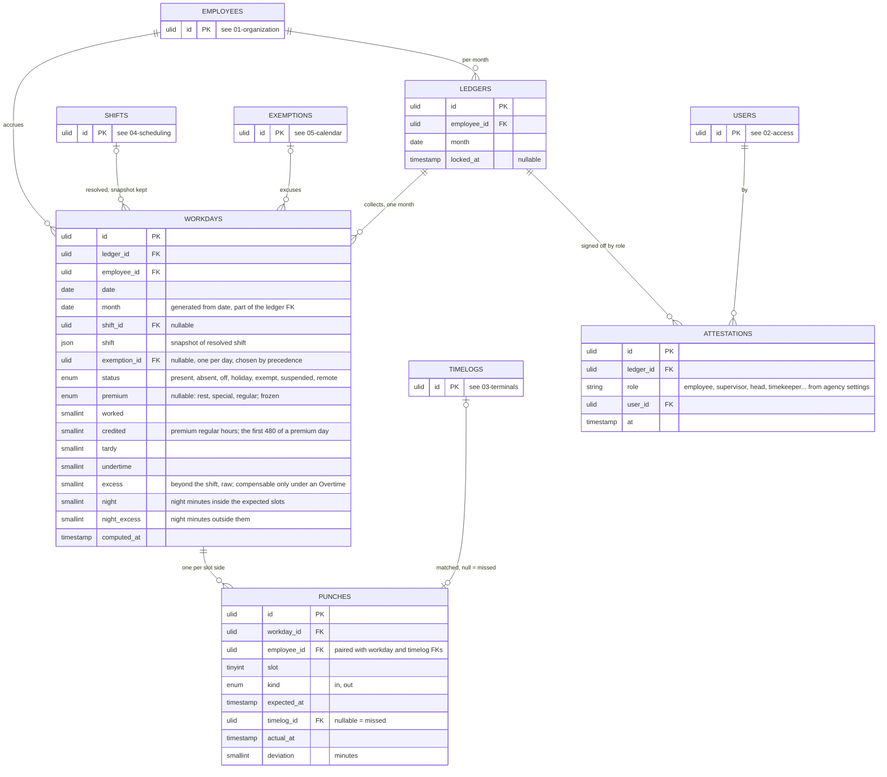

# 06 — attendance: workdays, punches, ledgers



## The chain, one day

`timelogs → punches → workdays → ledgers` is one pipeline with receipts kept in the middle.

| Table | One row is | Answers |
|---|---|---|
| Timelog | a raw fact: uid 42 touched device 3 at 07:58:12, state 0, mode 1 | what the device saw |
| Punch | one expected slot side of one workday, and the timelog that filled it, or null | which fact counted for which slot |
| Workday | employee E on date D: the shift snapshot plus the derived minutes and status | the DTR line |
| Ledger | employee E in month M: the DTR page with its lock and signatures | the DTR form |

Employee E, Standard shift, 8 Sep 2026. Terminal holds five timelogs for uid 42 that day: 07:58, 07:58 (double tap), 12:03, 17:05, 19:31.

| Punch | slot | kind | expected | timelog | actual | deviation |
|---|---|---|---|---|---|---|
| 1 | 1 | in | 08:00 | 07:58 | 07:58 | -2 |
| 2 | 1 | out | 12:00 | 12:03 | 12:03 | +3 |
| 3 | 2 | in | 13:00 | null | | missed |
| 4 | 2 | out | 17:00 | 17:05 | 17:05 | +5 |

The double tap and the 19:31 timelog stay in `timelogs`, unused. The workday reads: present, worked 480 less the missed slot per the agency rule, tardy 0, undertime 0, raw excess 5 with no `Overtime` authority so nothing compensable. The ledger for September collects that row with the other 21.

Timelog to Workday is many to many in principle, since an overnight shift can draw from two dates and a day draws from many timelogs. Punch is the resolution: exactly one timelog, or none, per slot side. Clockwork kept this in a json whose shape changed by case; a table gives a foreign key back to the timelog, a fixed shape, and a query for "every missed afternoon-in this month".

## Across midnight and month end

The workday of date D owns every punch of the shift that starts on D, including an out that the device records on D+1 or D+2. Punches carry full timestamps in `expected_at` and `actual_at`, so nothing is lost when the date differs from `workday.date`.

Night shift 22:00–30:00 on 30 September, out recorded 1 October 06:00:

| Fact | Where it lives |
|---|---|
| timelog 2026-10-01 06:00 | `timelogs`, dated October, untouched |
| punch slot 1 out, expected 2026-10-01 06:00, actual 06:00 | `punches`, row of the 30 September workday |
| workday 2026-09-30, `month` 2026-09-01 | September ledger, by the generated `month` |
| 1 October workday | its own shift only; the 06:00 timelog is already claimed |

Rules:

1. A timelog at time T can only belong to a workday dated T::date − 3 to T::date, the 72:00 slot cap. Recompute for that employee runs over those dates in order, so the earlier workday claims first. The unique index on `punches.timelog_id` makes a second claim impossible.
2. The ledger month is the workday's date, never the timelog's. The September ledger is complete only after the 1 October 06:00 timelog has arrived; recompute must not skip a workday because the timelog's month differs.
3. Locking waits for the outs. `locked_at` cannot be set while any punch of the ledger has `expected_at` later than the lock time; trigger `ledgers_lock_complete` in 07-constraints.md. Say if not.
4. **Status follows the day the duty started, and is never split** (decision 54). `status` and `premium` are one value each per row, so a 22:00 Sunday shift running into a Monday that is a regular holiday records Sunday's classification and nothing else. That is the paper form's own convention — the 48-hour example below puts forty October hours in September's totals for the same reason. Calendar-day attribution of *rates*, where payroll needs the 360 minutes that fell on Monday, is derived from `punches.actual_at` against dated holiday rows and never stored; the holidays consulted at compute time are frozen into the snapshot. The legal premise is a **default, not an invariant** — a contract, policy or CBA may attribute a whole night shift to the evening it began — so the other reading becomes a setting selecting between two stated policies when a real agency needs it, which costs nothing because the full timestamps survive.

## CS Form 48

The form is one renderer of the ledger view, not the storage. Its fixed columns are AM arrival, AM departure, PM arrival, PM departure, undertime hours and minutes.

| Slots in the shift | Printed as |
|---|---|
| 1 pair | each side in the column its own clock time falls in, AM before 12:00 and PM from 12:00, with the side taken from the punch `kind`: 08:00–17:00 prints an AM arrival and a PM departure, 22:00–06:00 prints a PM arrival and an AM departure `06:00⁺¹`. The two unused columns stay blank |
| 2 pairs | by clock when the four punches fall in four different columns, which is the ordinary day, 08:00–12:00 and 13:00–17:00. When they do not, because both pairs sit in the same half of the day, the four columns are positional: slot 1 takes the first pair of columns, slot 2 the second. An afternoon shift of 14:00–18:00 and 19:02–22:00, and a night shift of 22:00–02:00⁺¹ and 03:00⁺¹–06:00⁺¹, both print this way |
| 3 or more | first in and last out only, placed by the 1 pair rule. The form has four time columns and cannot hold more; the intermediate punches stay in the ledger view |
| a punch dated after the workday | the time with a day marker, `06:00⁺¹`, `08:00⁺²` |
| whole-day exemption | the exemption `type`, or its `reference` when the exemption carries an order number, across the four time columns |
| partial exemption | the punches as usual, with the excused side marked |
| missed punch | blank |
| punch whose `expected_at` is still in the future | `…`, pending, never missed |
| Off day inside a duty that started earlier | blank, status `off`; the hours are on the start day |
| undertime column | tardy plus undertime minutes of the workday |

Placement by clock time (decision 23) supersedes the earlier rule that a one-pair shift printed its arrival in the first column and its departure in the last, which put a 22:00 arrival in the AM column. The paper form asks for a time under a heading, so the heading is read literally wherever the day's punches allow it. They do not always allow it: the form carries four time columns, and two pairs inside one half of the day cannot be split across headings that do not exist, so those fall back to the positional layout. Every punch that belongs to a later date carries its day marker either way, which is what removes the ambiguity the headings then create.

September of a night-shift nurse, last rows:

```
Day   AM arr   AM dep   PM arr   PM dep    Undertime
 29            06:00⁺¹  22:00
 30            06:00⁺¹  22:03              0:03
```

The 1 October DTR starts at its own row 1 with its own shift. The 06:00 of 1 October appears once, on 30 September, in that row's AM departure column, in September.

48-hour duty, in 30 September 08:00, out 2 October 08:00, schedule Duty48, Off, Off, Off:

```
September                                        October
Day   AM arr   AM dep   PM arr   PM dep           Day   AM arr   AM dep   PM arr   PM dep
 30   08:00    08:00⁺²                              1
                                                    2
                                                    3   08:00    08:00⁺²
```

All 48 hours are credited to 30 September, so September's totals carry 40 hours that happened in October. That is the convention: credit follows the day the duty started, which is how the paper form is filled for duty rotations. Because every punch keeps its full timestamp, a payroll export that wants calendar-day hours, night hours on 1 October for instance, derives them from `actual_at`; the DTR view does not.

Until 2 October 08:00 the row prints `08:00 … ` and September cannot be locked. Printing before then is a draft.

## Workday

1. Unique on `employee_id, date`. One row per employee per calendar day in their employment range, computed, never hand-edited. `ledger_id` points at the month; `employee_id` stays for the daily lookup even though the ledger also has it.
2. Computation: resolve the shift, apply holiday, suspension and exemption, match timelogs to slots, derive minutes and status. Store the resolved shift as json so later edits to shifts do not move history.
3. Recompute when: a timelog at time T arrives for the employee, covering dates T::date − 3 to T::date in order; **a timelog at time T is voided**, covering the same span (decision 57 — `punches_timelog_live` guards insert only, so a punch that already claimed the record survives the void and the day goes on counting minutes the office has disowned); an enrollment changes; a roster or schedule changes for dates from today forward; a holiday, suspension, exemption or overtime authority touches the date; for compressed-week rosters, the whole ISO week of a holiday on an Off turn; **and when the date's following day is a regular holiday, the span extends forward to include it** (decision 66 — an unworked regular holiday's credit is conditional on the preceding work day, so a late timelog for the 24th changes the 25th, and every other event in this list reaches only backward).

## Punch

One row per expected slot side. `timelog_id` null means missed. Matching uses the shift's `window` and `grace`; the attlog `state` is a hint unless the shift says `trust`.

`actual_at` is the timelog's `time` **truncated to the minute** (decision 60). The device reports seconds — the worked example above is a 07:58:12 timelog against a 07:58 punch — and `timelogs.time` keeps them, so the raw fact stays reviewable through `timelog_id`. The punch holds the engine's reading of it, and holding two readings of one instant in the same row is what would let a timekeeper checking `tardy` by hand disagree with the engine.

## Daily rules

The computation, from csc-rules.md sections C and E. Minutes everywhere; days come from the constants lookup at report time.

**Whole minutes, reached by truncating instants and never by rounding spans** (decision 60). Every figure below is the difference of two minute-aligned instants, so the parts always sum to the whole — which is what the ledger's monthly totals are. Round each span independently instead and 07:00:00→08:23:30 is 84 while 08:23:30→17:00:00 is 517, and the two no longer add back to the 601 minutes the day spans. Truncation also never charges a minute the record cannot show: half a minute of lateness is not a minute of lateness.

1. **Status.** Off turn: `off`. Non-working holiday or whole-day suspension with no punches: `holiday` or `suspended`. Whole-day exemption of a type that excuses: `exempt`. Remote shift: `remote`, worked = required, nothing else. Shift with no punch at all: `absent`. Otherwise `present`. **Status describes the expectation, not the attendance**, so work rendered against an empty expectation does not move it: a worked Off turn stays `off` and a worked non-working holiday stays `holiday`, and what records the work is `credited`, `excess` and `premium` (rule 10). The asymmetry in the sentences above — `off` unqualified, `holiday` qualified by "with no punches" — is a wording artefact from before that rule existed and is resolved here in favour of the expectation reading, so a deriver has no case to guess at.
2. **Tardy** = per slot, `actual in − expected in − grace` when positive, summed. One tardy occurrence for the day when the sum is positive. A morning with no punches and an afternoon present is one tardy occurrence with the morning's minutes (MC 17 s. 2010).
3. **Undertime** = per slot, `expected out − actual out` when positive, summed. One undertime occurrence when positive. An afternoon with no punches and a morning present is one undertime occurrence with the afternoon's minutes (MC 17 s. 2010).
4. **Missing one side of a slot.** Agency setting: `void` treats the slot as not worked, its minutes become tardy or undertime as above; `assume` credits the slot to its expected span. Default `void`. A manual timelog or an exemption is the correction path. **`assume` is a rule of this section and never a punch** (decision 64): `punches_actual_pairs_timelog` makes `actual_at` non-null exactly when `timelog_id` is, so the missing side stays null on both columns and the credit is applied here, in the derivation. A synthetic `actual_at` would be an engine-invented time sitting in the same column as device-reported ones, and an auditor must be able to tell which minutes have evidence. "Flags the punch for review" is therefore not a column but the shape already in the data — one side of a slot filled and the other null — and the printed form shows that blank even where the totals credit the slot.
5. **Worked** = per slot, overlap of `[actual in, actual out]` with `[expected in, expected out]`, summed. **Excess** = minutes worked outside the expected slots, raw. **Night** = minutes of actual presence inside the agency's night window — `[settings.night_from, 06:00)`, which is **18:00** under RA 11701 and **22:00** under Labor Code Art. 86 (decision 33) — split across two columns by the same boundary that splits worked from excess: `night` is the part inside the expected slots, `night_excess` the part outside them, and their sum is the whole window (decision 53). The split is not cosmetic: JC 1 s. 2023 Annex C does not stack the differential on overtime hours, so a civil-service agency needs `night` alone, while Art. 86 and RA 7305 §18(b) attach a premium to overtime in the window and need both. The window in force is frozen into the workday's `shift` snapshot alongside the resolved slots, for the reason rule 2 of this section freezes the shift: both are stored columns, so a later settings change must not silently re-classify minutes already computed. A consumer needing a *different* boundary — RA 7305 §18(b) puts a government hospital's overtime premium at 22:00 while its differential stays at 18:00 — derives it from `actual_at` rather than from this column, which is the mechanism "Across midnight and month end" already establishes for calendar-day night hours.
**What `worked` is when the calendar emptied the day** (decisions 65 and 66). `worked` is the minutes credited toward the day's requirement, and rule 5's overlap is how that is measured where attendance earns it. Where the law credits the day without attendance, the credit is `required` and no punch enters it. It is not uniform across empty days, and the natural single `if` on "the expectation is empty" overpays every special day:

| The day | `worked`, nobody having attended |
|---|---|
| Regular holiday, on a working turn **or** on a rest day | `required` — **conditional** on presence or paid leave the immediately preceding work day (`dole-rules.md` F) |
| Special or local day, on a working turn or a rest day | **0** — "no work, no pay" absent policy or a CBA |
| `Off` turn with no holiday | 0 — a rest day carries no requirement to credit |
| `remote` shift | `required` (rule 1) |
| Whole-day suspension | `required` when `settings.suspension_charge` is false; the CSC charging rule when true. There is no private-sector counterpart to it, which is what the setting suppresses |
| No roster (decision 63) | 0 — there is no `required` to credit |

`worked` and `credited` are different entitlements and never collapse. On a regular holiday somebody works, `worked = required` is the holiday pay the day carries regardless and `credited` is rule 10's first 480 premium regular minutes for the work done — 100% and 200% of different bases. Under CSC `premium_hours` is false, `credited` stays 0, and the work is `excess` against an `Overtime` authority.

6. **No offsetting.** Excess never reduces tardy or undertime (Rule XVII §9, JC 2 s. 2015 §10.4). Compensable overtime is not a workday number; the ledger's overtime view is excess ∩ Overtime authority, gated per 05-calendar.md rule 6.
7. **Holiday, suspension, exemption** apply as in 05-calendar.md. Suspension truncates expected slots at `starts`; the absent part before `declared_at` is charged as in Omnibus Rules on Leave §32. An exemption's covered minutes are excused from tardy, undertime and absence; `travel` also zeroes excess. The deriver asks `Exemption::excused()` before it excuses anything, so a `personal` slip changes no minute: the day's tardiness, undertime and absence stand as the punches make them and the minutes are charged to leave, while the slip is still recorded and printed (05-calendar.md rule 7, decision 19). Minutes are excused from **every** exemption covering the day, but `workdays.exemption_id` stamps one, by precedence (decision 50): `excused()` true first, then more covered minutes, then earlier `approved_at`, then lower `id`. The stamp is a summary for the printed form, never the authority — a corrected precedence recomputes and loses nothing.
8. **Compressed week.** Holiday on a Long turn: `holiday`, worked = required. Holiday on an Off turn: the rest of that ISO week resolves to the fallback shift for dates after `declared_at`; minutes already rendered stand.
9. **Monthly occurrences** for MC 04 s. 1991 and MC 16 s. 2010 are counted on the ledger: workdays with a tardy occurrence, with an undertime occurrence, and `absent` days without an exemption. Derived, never stored. Suppressed when `settings.occurrences` is false, which is the Labor Code case — no statutory occurrence counting exists there, and a habitual-tardiness count on a private employer's DTR is a number with no rule behind it (`../reference/dole-rules.md` section H).

10. **Premium days.** A day is a premium day when its expectation is empty *after the calendar has been applied*: an `Off` turn, which is a rest day, or a holiday that `HolidayType::expectsWork()` says expects none — which includes a regular holiday landing on an ordinary working turn, its slots having been removed by rule 1 of 05-calendar.md. Such a day carries `premium`: `rest` for the Off turn, `regular` or `special` for the holiday, `local` classifying as `special` (decision 49). Coincident causes take the stronger: `regular` over `special` over `rest`. The first **480** minutes of actual attendance on such a day become `credited`, the rest stays `excess`; 480 is tier 1a of 00-principles.md, the universal ordinary day, and deliberately not the shift's prescribed length, because a day with no expectation has none to read. Under Labor Code Arts. 93–94 those first eight hours are regular hours at a premium — 130% on a rest or special day, 200% on a regular holiday — and only the hours past them are overtime; the multipliers are payroll's, and khronoz stores the minutes and the class, never a peso. **`credited` alone is gated on `settings.premium_hours`, default false; `premium` is always classified.** A civil-service agency has no premium-regular-hours concept — its holiday work is `excess` against an `Overtime` authority — so `credited` stays 0 there and every CSC number is what it was before this rule existed. The class is still recorded, because it costs one varchar and it is the fact that cannot be reconstructed later: holiday rows and roster turns both move, and a day's premium standing has to be answerable from the row after they do. `premium` is frozen at compute time for the reason the shift snapshot is.

11. **The weekly ceiling.** Where `settings.overtime_after_weekly` is set — 48 hours under a compliant compressed week, DA 02-04 — the week's overtime is `max(Σ daily excess, week total − ceiling)` over the ISO week, where the week total is `Σ (worked + credited)`. It is a maximum and not a sum: the advisory makes work beyond twelve hours a day *or* forty-eight a week overtime, so adding both charges a thirteen-hour Tuesday twice. Derived at read time by `App\Attendance\Week`, never stored, and loaded by ISO-week bounds rather than from a ledger, because a week straddles a month end (decision 52). Null ceiling means the rule does not bind and `Σ daily excess` stands, which is the civil-service case.

### Settled before Milestone 6

Seven items sat here as recorded defects, four of them found by a two-lineage
adversarial review on 2026-09-10 and all confirmed against the committed text.
Decision 34 said the fix was a rework of this computation model rather than a
wording correction, and that rework is Milestone 6. They were settled on
2026-09-11, before any of its code was written, as decisions 49 to 57. An
eighth was found in the settling.

| Was | Now | Where the rule lives |
|---|---|---|
| Holiday and rest-day work collapsed into `excess`, with no column for premium-rate regular hours — **a private-sector agency could not be billed** | `workdays.premium` and `workdays.credited`, gated on `settings.premium_hours` | decision 51, daily rule 10 |
| No ISO-week accumulator, while `settings.overtime_after_weekly` already existed | `App\Attendance\Week`, derived at read time, `max` and not a sum | decision 52, daily rule 11 |
| `workdays.night` was one scalar and could not separate regular from overtime night minutes | `night` and `night_excess`, partitioned by the expected slots | decision 53, daily rule 5 |
| Cross-midnight attribution of day *status* was unstated | Credit follows the day the duty started; the calendar-day split is derived from `actual_at`. A default, not an invariant | decision 54, "Across midnight and month end" |
| A locked or attested ledger month did not freeze the deployment ranges it was computed from (owed by decision 35) | Trigger `deployments_frozen_month`, checking `OLD` as well as `NEW` | decision 55, 07-constraints.md |
| Two exemptions on one day had no stated winner | Precedence: `excused()`, then more covered minutes, then earlier `approved_at`, then lower `id`. **Reverses this file's own tentative "narrower window"** | decision 50, daily rule 7 |
| `local` holidays had no stated effect | `HolidayType::expectsWork()` is the one place that decides; `local` behaves as `special` | decision 49, 05-calendar.md rule 1 |
| **Found while settling the rest:** voiding a timelog did not recompute, so a struck-out record kept being counted | Rule 3 below gains a sixth event | decision 57 |

### Still open, and deliberately so

None of these blocks the engine; each needs a real case or a primary-text check
rather than an invented rule.

1. **Successive regular holidays**, Book III Rule IV §10 — an employee absent without pay on the workday immediately preceding the first holiday loses pay for both, unless they work on the first. Multi-day evaluation across a holiday sequence, and the condition reads the *previous* workday's status (`../reference/dole-rules.md` section I items 5 and 12).
2. **The hours-worked doctrine** for required pre- and post-shift activity, waiting time, on-call and non-voluntary training (Book III Rule I §§3–6). On-call counts only where mobility is restricted, §5(b), and never under RA 7305 §15, which pays 50% instead — a per-agency rule about premises-binding, not a regime switch.
3. **Mandatory overtime rest breaks.** JC 2 s. 2015 §10.2 is cited for a one-hour break every three continuous overtime hours and §8.2.1 for overtime being exclusive of lunch and rest, so multi-hour overtime with no intermediate punches may owe an automatic deduction. The citation is a `☆` claim in `../reference/csc-rules.md` and unverified in primary text.
4. **`supervisor` under a detail** — the receiving workgroup's head observed the attendance, the mother's holds the plantilla item. Left open by decision 31 on purpose.
5. **A week straddling a locked month.** `App\Attendance\Week` reads whatever workdays exist and reports them; whether a half-frozen week may be reported at all needs a real month end (decision 52).

## Ledger

1. One row per employee per month, created by the first workday computed in that month (`firstOrCreate` on `employee_id, month`). Stores `locked_at` only. Totals and the monthly occurrence counts are computed from its workdays.
2. Views take two orthogonal parameters, never stored:

| Parameter | Enum | Values |
|---|---|---|
| `period` | `Period` | `first` 1 to 15, `second` 16 to end, `full` |
| `work` | `Work` | `regular`, `overtime`, null for both |

```php
$ledger->view(Period::First, Work::Overtime);
$ledger->view(Period::Full);
```

3. Locking freezes the month against recomputation. The recompute job checks `workday.ledger.locked_at` before touching a row. The lock itself waits for pending outs (above).

## Attestation

CS Form 48 is certified by the employee and verified by the in-charge. Agencies add a department head or the timekeeper. Who signs, and in what order, is agency data, not schema.

1. `attestations`: `ledger_id`, `role`, `user_id`, `at`. One row per role per ledger.
2. The agency setting `attestations` lists the required roles in order. Default `[employee, supervisor]`. `[employee, supervisor, head]` or `[supervisor, head, timekeeper]` are settings, not code.
3. Who may sign a role comes from the org tree. `employee`: the ledger's own employee through their user. `supervisor`: `Workgroup.head_id` of the employee's deployment in that month. `head`: the head of the nearest ancestor workgroup of the kind the setting names, department for instance — walked up from the employee's **substantive** placement, so under a detail the mother department signs last, not the receiving one (01-organization.md rule 7, decision 31). `timekeeper`: any user of the agency holding `ledgers.attest`. The row records who actually signed.

   **Open item** (decision 31): under a detail, whether `supervisor` resolves from the receiving workgroup's head, who observed the attendance, or from the mother's, depends on the arrangement. Unsettled deliberately — it needs a real case rather than an invented rule, and until then the sentence above resolves it from whichever deployment covers the month, which is ambiguous while two do.
4. A ledger is complete when every listed role has a row.
5. Attestations are only possible on a locked ledger, and a ledger with attestations cannot be unlocked until they are removed. You certify frozen numbers, never moving ones. Triggers in 07-constraints.md.
6. Timestamps and user ids only. No signature images, no certificates.
